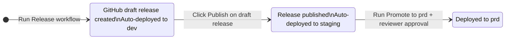
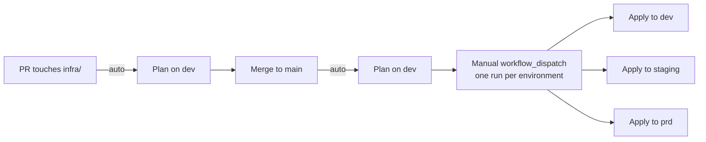

[](https://github.com/rodekruis/qualitative-feedback-analysis/actions/workflows/ci.yaml)
[](https://github.com/rodekruis/qualitative-feedback-analysis/actions/workflows/github-code-scanning/codeql)

# Qualitative Feedback Analysis

# About

The feedback analysis tool receives feedback items and analyses trends, topics and their evolution over time.

The feedback is collected in a CRM system and sent to this backend for analysis.

Each request contains dozens to thousands of feedback documents.

The documents need to be analysed and, and the result sent back to the CRM system in a
synchronous API call.

## Tech stack
* fastapi
* uvicorn
* pydantic for settings manangement and environment loading
* OpenAI API for document analysis

## Architecture
* hexagonal architecture.
* Flow: API call(documents) -> Orchestrator -> LLM API -> return result to user.
* The Orcehstrator is an exchangeable service. 
  * naive version: forward all documents to the LLM in one call, together with system prompt and user prompt
  * possible future versions: apply embedding, chunking, other "smart" techniques, possibly multiple LLM calls.

## Requirements
* only authenticated API calls (via API keys)
* synchronous API calls impose a limit on processing time (TBD, let's assume 2 minutes for now)

## Non-functional requirements:
* LLM provider must be exchangeable: declared via an `LLMPort`, so that implementation can be swapped
* Orchestrator must be swappable depending on task.
  TBD: either via different API end points, API request parameters or automatically depending on task
* hardened security.

# Deployment

Deployed to Azure App Service via Terraform (infrastructure) and GitHub Actions (app code).

## First-time setup

Before the CI/CD pipeline can run, the Azure infrastructure and GitHub environments must be bootstrapped locally:

1. [infra/BOOTSTRAP.md](infra/BOOTSTRAP.md) — one-time per deployment: Terraform state backend, shared container registry, and repo-scoped GitHub variables.
2. [infra/setup-new-env.md](infra/setup-new-env.md) — run once per environment (`dev`, `staging`, `prd`, or any added later): Terraform workspace, App Service, Key Vault, managed identity, env-scoped GitHub variables, and Key Vault secrets.

## CI/CD pipeline

The release-promotion flow at a glance:



Three human actions drive the whole flow: run the Release workflow, click Publish on the draft release, and run Promote to prd (with reviewer approval). Publishing is both the sign-off that dev validation passed *and* the staging-deploy trigger — the click fires `auto-staging-on-publish.yaml`, which deploys the same digest to staging with no extra workflow run. The same image digest flows through all three states — no rebuilds between environments.

### For a normal release of, e.g., v0.4.0:

  1. Human runs Release from the Actions tab. CI runs, version bumps to v0.4.0, image builds, gets pushed to ACR as qfa-backend:v0.4.0, registry digest captured, draft
  release v0.4.0 created with the digest in its body, dev App Service updated to run that digest. Total: one click.
  2. Human pokes around in dev. Finds nothing wrong.
  3. Human goes to Releases page, clicks Publish on the v0.4.0 draft. Publishing the release automatically fires `auto-staging-on-publish.yaml`, which deploys the same digest to staging — the click is both the sign-off that dev validation passed *and* the trigger for the staging deploy.
  4. Final smoke testing in staging.
  5. Human runs Promote to prd with input v0.4.0. Verify job checks published-and-not-prerelease, then enters the prd environment, which triggers GitHub's
  required-reviewers prompt. Reviewer approves. Same digest deploys to prd.

> [!NOTE]
> The manual `Promote to dev` and `Promote to staging` workflows exist as **secondary** paths — used to restore an environment to a specific released tag outside the normal forward flow. Typical uses: re-point dev back to a release after an ephemeral feature-branch build (see below), roll staging back to a prior release, or re-stage an older release for re-validation. They are not part of the normal forward flow.

 ### For a rollback, e.g., from v0.4.0 to v0.3.7:

  1. Human runs Promote to prd with input v0.3.7. Verify passes (v0.3.7 is published and final). Reviewer approves the prd environment prompt. App Service is repointed to
   v0.3.7's digest, which is still sitting in ACR. Done.

### For testing a feature branch in dev without cutting a release:

  1. Human runs Build from commit with ref: feat/some-experiment and deploy_to_dev: true. Ephemeral image gets built and pushed as
  qfa-backend:ephemeral-feat-some-experiment-abc1234, dev gets updated to that digest. No release is created — so the image cannot enter the promotion pipeline. To get
  back to a real release, run Promote to dev with the latest released tag.

### For an infrastructure change:

The infra flow at a glance:



Contrast with the release flow above: applies fan out from a single manual-dispatch hub to three independent environments — there is no promotion chain and no enforced ordering between them. `plan` runs automatically on PRs and on `main`, but `apply` is manual-only.

Infrastructure (Azure App Service, Key Vault, managed identities, etc.) is managed by Terraform and deployed **independently** of application code. Unlike the app release flow above, there is no automatic promotion chain — each environment must be applied manually from the Actions tab.

The `terraform.yaml` workflow (`.github/workflows/terraform.yaml`) runs `plan` automatically on PRs and pushes touching `infra/`, but **never runs `apply` automatically** — `apply` only executes when dispatched manually with `command: apply`.

  1. Human opens a PR touching `infra/`. CI runs `terraform plan` automatically so reviewers can see the proposed diff. Note that the automated plan runs against the `dev` workspace only — diffs against `staging` / `prd` require a manual `workflow_dispatch` run.
  2. Human merges the PR to `main`. Plan runs again on `main` as a sanity check. Nothing is applied.
  3. Human runs the `Terraform` workflow from the Actions tab with `environment: dev`, `command: apply`. Verifies dev.
  4. Human repeats step 3 for `staging`, then for `prd`.

> [!IMPORTANT]
> If an infrastructure change is a prerequisite for an app version (e.g. a new Key Vault reference, a new environment variable binding), apply the infra change to a given environment **before** promoting the app release that depends on it — otherwise the App Service will start but fail at runtime when the missing reference resolves.

## GitHub Configuration

GitHub environments (`dev`, `prd`) and their required Actions variables are managed by Terraform. See [infra/BOOTSTRAP.md](infra/BOOTSTRAP.md).


# Getting Started

## Prerequisites

- Python 3.12+
- [uv](https://docs.astral.sh/uv/) package manager

## Installation

```bash
uv sync
```

## Configuration

### Environment Variables

Create a `.env` file in the project root (or export the variables in your shell). Only two variables are required; all others have sensible defaults.

| Variable | Required | Default | Description |
|----------|----------|---------|-------------|
| `LLM_API_KEY` | **yes** | — | API key for OpenAI or Azure OpenAI |
| `AUTH_API_KEYS` | **yes** | — | JSON array of API key objects (see below) |
| `LLM_PROVIDER` | no | `openai` | LLM backend: `openai` or `azure_openai` |
| `LLM_MODEL` | no | `gpt-4.1-mini` | Model name |
| `LLM_AZURE_ENDPOINT` | no | `""` | Azure OpenAI endpoint URL (required when provider is `azure_openai`) |
| `LLM_API_VERSION` | no | `""` | Azure OpenAI API version (required when provider is `azure_openai`) |
| `LLM_TIMEOUT_SECONDS` | no | `115.0` | Timeout for LLM calls in seconds |
| `LLM_MAX_RETRIES` | no | `3` | Max retry attempts for LLM calls |
| `LLM_MAX_TOTAL_TOKENS` | no | `100000` | Token budget for entire request |
| `ORCHESTRATOR_METADATA_FIELDS_TO_INCLUDE` | no | `[]` | Metadata fields forwarded to the LLM |
| `ORCHESTRATOR_RETRY_BASE_SECONDS` | no | `1.0` | Initial backoff delay |
| `ORCHESTRATOR_RETRY_MULTIPLIER` | no | `2.0` | Exponential backoff multiplier |
| `ORCHESTRATOR_RETRY_JITTER_FACTOR` | no | `0.5` | Jitter factor for backoff |
| `ORCHESTRATOR_RETRY_CAP_SECONDS` | no | `10.0` | Maximum backoff delay |
| `ORCHESTRATOR_CHARS_PER_TOKEN` | no | `4` | Chars-per-token estimate ratio |

Minimal `.env` example:

```dotenv
LLM_API_KEY=sk-your-openai-key
AUTH_API_KEYS='[{"name":"crm-production","key":"sk-prod-abc123def456","tenant_id":"tenant-redcross-nl"}]'
```

### API Keys

API authentication is configured via the `AUTH_API_KEYS` environment variable. The value is a JSON array of objects, each representing a tenant with its own API key.

**Format** — a JSON array of objects, each with three fields:

| Field | Type | Description |
|-------|------|-------------|
| `name` | string | Human-readable label for the key (e.g. `"crm-production"`) |
| `key` | string | The secret API key value |
| `tenant_id` | string | Tenant identifier associated with this key |

**Example:**

```bash
export AUTH_API_KEYS='[
    {"name": "crm-production", "key": "sk-prod-abc123def456", "tenant_id": "tenant-redcross-nl"},
    {"name": "staging", "key": "sk-staging-xyz789", "tenant_id": "tenant-staging"}
]'
```

**How it works:**

1. At startup the application parses the JSON and validates every entry.
2. Clients authenticate by sending an `Authorization: Bearer <key>` header.
3. The key is matched using constant-time comparison (`secrets.compare_digest`) to prevent timing attacks.
4. On success, the request is tagged with the matching `tenant_id`.

### Managing keys in production (Azure Key Vault)

In production, API keys are stored as a JSON secret (`AUTH-API-KEYS`) in Azure Key Vault and loaded by the app at startup. Use [`scripts/update_auth_api_keys.py`](scripts/update_auth_api_keys.py) to add, replace, or remove keys without touching the vault manually — see the module docstring at the top of the script for the full CLI reference.

**Prerequisites**

```bash
az login                                        # authenticate with the Azure CLI
export AZURE_KEYVAULT="<keyvault-name>"         # e.g. qfa-prd-keyvault
```

**Usage**

```bash
uv run python3 scripts/update_auth_api_keys.py --add     <tenant>   # add a new key (keeps existing)
uv run python3 scripts/update_auth_api_keys.py --replace <tenant>   # replace all keys for tenant with one new key
uv run python3 scripts/update_auth_api_keys.py --remove  <tenant>   # delete all keys for tenant
```

The script prints the generated key to stdout — copy it and share it with the tenant. It is not recoverable from Key Vault afterwards (only its hash is used at runtime).

**Example**

```
$ uv run python3 scripts/update_auth_api_keys.py --add prd
No existing keys for tenant 'prd'.
Added key 'prd-0' for tenant 'prd'.
Key: xK9mR2vNpL4wQjT8...
```

## Running the Application

```bash
uv run python -m qfa.main
```

The server starts on `http://0.0.0.0:8000`. For development with auto-reload:

```bash
uv run uvicorn qfa.main:app --reload --host 0.0.0.0 --port 8000
```

## API

All API endpoints except `GET /v1/health` require a valid API key:

```text
Authorization: Bearer <key>
```

### `POST /v1/analyze`

Analyzes a batch of feedback items and returns one aggregate analysis result.

### `POST /v1/summarize`

Summarizes each feedback item individually and returns a `title` and bullet-point
`summary` for every submitted item.

# Development

## Setup

```bash
uv sync
uv run pre-commit install
```

## Running Tests

```bash
make test
```

## Linting

```bash
make lint
```

## Formatting

```bash
make format
```
