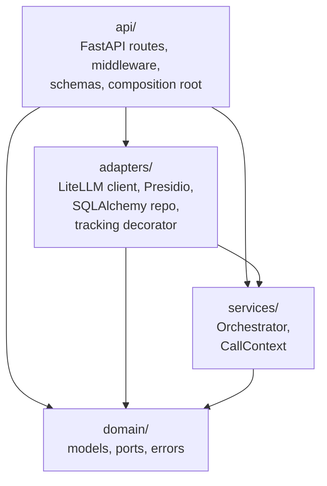

# Architecture style

The service is built as a **hexagonal application** (ports & adapters), with four packages enforced by `import-linter` contracts in `pyproject.toml`.

## Why hexagonal here

Three things tipped the decision:

1. **Multiple distinct external worlds.** The core talks to an LLM provider (via LiteLLM), a PII detection engine (Presidio), and a usage-tracking database (Postgres). Each is independent and changes at a different cadence.
2. **Swap stories that we actually want to swap.** Test runs use a `FakeLLMPort` injected through `create_app(llm_factory=…)`; usage tracking can be turned off via `DB_TRACK_USAGE=false`; the anonymiser can be replaced for offline tests.
3. **Audit story for sensitive data.** Beneficiary feedback under humanitarian-data norms benefits from an enforced "no vendor SDK imports in the domain layer" rule. `import-linter` gives that answer in CI.

See [ADR-001](../adr/001-pydantic-domain-models.md) through [ADR-011](../adr/011-drop-orchestrator-port.md) for individual decisions; [ADR-002](../adr/002-protocol-based-ports.md) and [ADR-011](../adr/011-drop-orchestrator-port.md) are the load-bearing ones.

## Layer diagram

Allowed import directions (enforced by `import-linter`):

- **`qfa.domain`** — imports nothing from the project, and none of `openai`, `litellm`, `presidio_*`, `fastapi`, `starlette`, `tenacity`.
- **`qfa.services`** — imports `qfa.domain` only; same third-party prohibitions minus `tenacity`.
- **`qfa.adapters`** — sibling of `api`; may import from `services` and `domain`. Each adapter class explicitly inherits from its port (see [the project guidelines](../../AGENTS.md)).
- **`qfa.api`** — sibling of `adapters`; the composition root in `app.py` is the only place that wires concrete adapters into ports.

## What's *not* hexagonal here

Hexagonal tells us "services depend only on ports" — it doesn't say "one orchestrator class with N methods" versus "N orchestrator classes." The current `Orchestrator` is one class with four operations (`analyze`, `summarize`, `summarize_aggregate`, `assign_codes`), per [ADR-011](../adr/011-drop-orchestrator-port.md). Extracting individual use cases into their own services is anticipated when any one grows enough to warrant it.

## Further reading

- [System context](02-system-context.md) — what surrounds the app
- [Components](03-components.md) — ports, adapters, the orchestrator
- [Cross-cutting concerns](04-crosscutting.md) — concerns that span layers
- [Data model](05-data-model.md) — domain models and persistence
