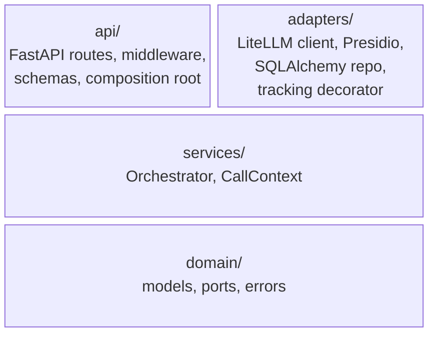

# Architecture style

The service is built as a **hexagonal application** (ports & adapters), with four packages enforced by `import-linter` contracts in `pyproject.toml`.

## Why hexagonal here

Four things tipped the decision:

1. **Multiple distinct external worlds.** The core talks to an LLM provider (via LiteLLM), a PII detection engine (Presidio), and a usage-tracking database (Postgres). Each is independent and changes at a different cadence — exactly the shape hexagonal was designed for.
2. **Parallel work along port boundaries.** Once a port is named, dev A can build the use case against a typed fake while dev B implements the real adapter — the port type is the contract that lets the two streams converge cleanly at the end. The same shape unblocks investigation work: try a second LLM provider behind the existing port without touching the orchestrator.
3. **Type-checked fakes beat monkey-patches.** Tests inject `FakeLLMPort` (and analogous fakes for {py:class}`~qfa.domain.ports.AnonymizationPort`, {py:class}`~qfa.domain.ports.UsageRepositoryPort`) through `create_app(llm_factory=…)`. Because every fake inherits explicitly from its port, the type-checker catches drift the moment the contract shifts — there's no stale `unittest.mock.patch` chain silently passing a test against a long-changed interface.
4. **Well-known and battle-tested.** Hexagonal is recognisable enough that experienced developers and AI coding agents both navigate the layout without the architecture being explained first — a real onboarding-cost saving when both kinds of contributor are in the loop.

See [ADR-001](../adr/001-pydantic-domain-models.md) through [ADR-011](../adr/011-drop-orchestrator-port.md) for individual decisions; [ADR-002](../adr/002-protocol-based-ports.md) and [ADR-011](../adr/011-drop-orchestrator-port.md) are the load-bearing ones.

## Layer diagram

Each row may import from any row below it, never from a row above. `api/` and `adapters/` are siblings on the top row: neither imports from the other; both are wired together by the composition root in `api/app.py`.

Allowed import directions (enforced by `import-linter`):

- **`qfa.domain`** — imports nothing from the project, and none of `openai`, `litellm`, `presidio_*`, `fastapi`, `starlette`, `tenacity`.
- **`qfa.services`** — imports `qfa.domain` only; same third-party prohibitions minus `tenacity`.
- **`qfa.adapters`** — sibling of `api`; may import from `services` and `domain`. Each adapter class explicitly inherits from its port (see [the project guidelines](https://github.com/rodekruis/qualitative-feedback-analysis/blob/main/AGENTS.md)).
- **`qfa.api`** — sibling of `adapters`; the composition root in `app.py` is the only place that wires concrete adapters into ports.

## What's *not* hexagonal here

Hexagonal tells us "services depend only on ports" — it doesn't say "one orchestrator class with N methods" versus "N orchestrator classes." The current {py:class}`~qfa.services.orchestrator.Orchestrator` is one class with four operations (`analyze`, `summarize`, `summarize_aggregate`, `assign_codes`), per [ADR-011](../adr/011-drop-orchestrator-port.md). Extracting individual use cases into their own services is anticipated when any one grows enough to warrant it.

## Further reading

- [System context](02-system-context.md) — what surrounds the app
- [Components](03-components.md) — ports, adapters, the orchestrator
- [Cross-cutting concerns](04-crosscutting.md) — concerns that span layers
- [Data model](05-data-model.md) — domain models and persistence
