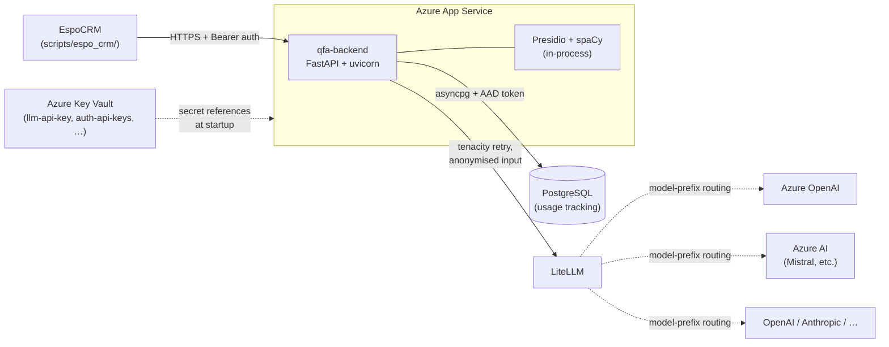

# System context

The qfa-backend runs as a single FastAPI service. This page shows what surrounds it.

## Diagram

## External neighbours

| System | Direction | Notes |
|---|---|---|
| **EspoCRM** | inbound | The primary integration. Calls the analyze/summarize/assign-codes endpoints via small server-side scripts in `scripts/espo_crm/`. Auth: bearer token (see [API key management](../operations/auth-management.md)). |
| **LiteLLM** | outbound | A library that routes to the actual LLM provider based on the model string prefix (`azure/…`, `azure_ai/…`, `openai/…`, `anthropic/…`). Configured by `LLM_MODEL`, `LLM_API_KEY`, `LLM_API_BASE`, `LLM_API_VERSION`. |
| **PostgreSQL** | outbound | Stores one row per LLM call for cost / token / latency reporting (table `llm_calls`). Auth is either password-based (`DB_AUTH_MODE=password`) or AAD token (`DB_AUTH_MODE=entra`). |
| **Presidio + spaCy** | in-process | PII detection runs inside the app container — no network hop. |
| **Azure App Service** | hosting | Runs the container. The `entrypoint.sh` script runs DB migrations before `uvicorn` binds (multi-replica-safe via Postgres advisory lock). |
| **Azure Key Vault** | startup-time | Secrets (`llm-api-key`, `llm-api-base`, `auth-api-keys`) reach the App Service via Key Vault references. The container never sees the vault directly. |

## Out of scope for this diagram

- **GitHub Actions / Terraform.** The CI/CD pipeline provisions everything above; see [Infrastructure bootstrap](../operations/bootstrap.md) and [Set up a new environment](../operations/setup-new-env.md).
- **Observability backends.** Logs currently go to stdout / App Service log streams; no APM is wired up.
