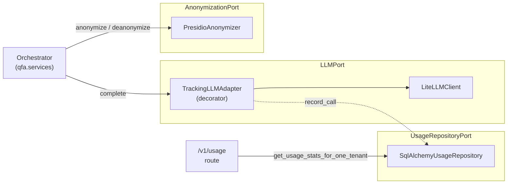

# Components

The hexagonal layout has three ports, one application service, and a composition root that wires them together.

## Ports and adapters

| Port | Adapter(s) | What it owns |
|---|---|---|
| {py:class}`~qfa.domain.ports.LLMPort` | {py:class}`~qfa.adapters.llm_client.LiteLLMClient`; optionally wrapped by {py:class}`~qfa.adapters.tracking_llm.TrackingLLMAdapter` when `DB_TRACK_USAGE=true` | One method, `complete(system_message, user_message, tenant_id, response_model, timeout)`. Returns `LLMResponse[T_Response]` carrying the structured output plus token counts and cost. |
| {py:class}`~qfa.domain.ports.AnonymizationPort` | {py:class}`~qfa.adapters.presidio_anonymizer.PresidioAnonymizer` | `anonymize(text) -> (text, mapping)` and `deanonymize(text, mapping) -> text`. The mapping is held in memory for the request lifetime, then discarded. |
| {py:class}`~qfa.domain.ports.UsageRepositoryPort` | {py:class}`~qfa.adapters.usage_repository.SqlAlchemyUsageRepository` | Writes one {py:class}`~qfa.domain.usage_models.LLMCallRecord` per LLM call (from {py:class}`~qfa.adapters.tracking_llm.TrackingLLMAdapter`) and reads aggregate stats (from the `/v1/usage` routes). |

The tracking decorator is the only place hex's "stack adapters at the composition root" earns its keep — {py:class}`~qfa.adapters.tracking_llm.TrackingLLMAdapter` is itself an {py:class}`~qfa.domain.ports.LLMPort`, so the orchestrator never knows whether tracking is on.

## The orchestrator

{py:class}`~qfa.services.orchestrator.Orchestrator` is one class with four async methods, each backing one HTTP endpoint:

| Method | Endpoint | What it does |
|---|---|---|
| `analyze` | `POST /v1/analyze` | One LLM call. Free-text summary of themes across submitted records. |
| `summarize` | `POST /v1/summarize` | One LLM call. Per-record summaries with a self-evaluated quality score. |
| `summarize_aggregate` | `POST /v1/summarize-aggregate` | Two LLM calls (summary + judge). Single aggregate summary with a calibrated score. |
| `assign_codes` | `POST /v1/assign_codes` | Multiple LLM calls per record: pick + judge at each level of a hierarchical coding framework. |

Each method is pure use-case logic — no scope or correlation plumbing. `call_scope` is entered by a FastAPI dependency declared on the route (`Depends(call_scope_for(Operation.X))`), so by the time an orchestrator method runs `current_call_context` is already set. See [Cross-cutting concerns](04-crosscutting.md) for the full picture.

## Composition root

`qfa.api.app.create_app()` builds the FastAPI instance; the `lifespan` context manager wires the dependency graph at startup. The wiring is roughly:

1. Load settings.
2. Construct the base {py:class}`~qfa.domain.ports.LLMPort` (a {py:class}`~qfa.adapters.llm_client.LiteLLMClient`).
3. If `DB_TRACK_USAGE` is on:
   - Construct the {py:class}`~qfa.domain.ports.UsageRepositoryPort` (a {py:class}`~qfa.adapters.usage_repository.SqlAlchemyUsageRepository`).
   - Wrap the base {py:class}`~qfa.domain.ports.LLMPort` in a {py:class}`~qfa.adapters.tracking_llm.TrackingLLMAdapter` that delegates to the inner port and records each call to the repository.
4. Construct the {py:class}`~qfa.domain.ports.AnonymizationPort` (a {py:class}`~qfa.adapters.presidio_anonymizer.PresidioAnonymizer`).
5. Construct the {py:class}`~qfa.services.orchestrator.Orchestrator` with the (possibly wrapped) ports.
6. Stash the orchestrator, API keys, and — when present — the usage repository on `app.state` for the request lifecycle to read.

This is the **only** place that knows about concrete adapter classes. Routes and dependencies read from `app.state` only.

## Test seam

`create_app(llm_factory=…)` lets end-to-end tests inject a `FakeLLMPort` without monkey-patching. The lifespan still runs — so the *real* {py:class}`~qfa.adapters.tracking_llm.TrackingLLMAdapter`, {py:class}`~qfa.adapters.presidio_anonymizer.PresidioAnonymizer`, and migrations all execute. Only the bottom-most layer (the actual LLM call) is faked. See `tests/e2e/conftest.py`.
