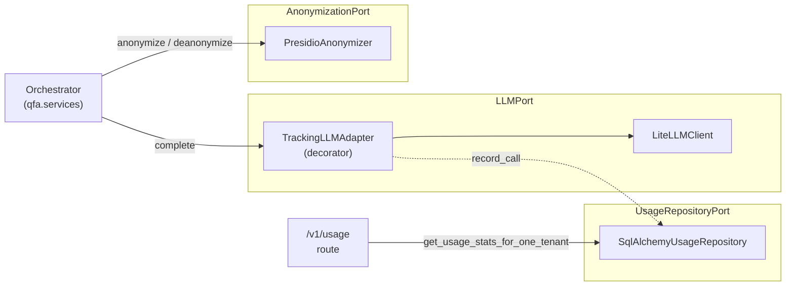

# Components

The hexagonal layout has three ports, one application service, and a composition root that wires them together.

## Ports and adapters



| Port | Adapter(s) | What it owns |
|---|---|---|
| {py:class}`~qfa.domain.ports.LLMPort` | {py:class}`~qfa.adapters.llm_client.LiteLLMClient`; optionally wrapped by {py:class}`~qfa.adapters.tracking_llm.TrackingLLMAdapter` when `DB_TRACK_USAGE=true` | One method, `complete(system_message, user_message, tenant_id, response_model, timeout)`. Returns `LLMResponse[T_Response]` carrying the structured output plus token counts and cost. |
| {py:class}`~qfa.domain.ports.AnonymizationPort` | {py:class}`~qfa.adapters.presidio_anonymizer.PresidioAnonymizer` | `anonymize(text) -> (text, mapping)` and `deanonymize(text, mapping) -> text`. The mapping is held in memory for the request lifetime, then discarded. |
| {py:class}`~qfa.domain.ports.UsageRepositoryPort` | {py:class}`~qfa.adapters.usage_repository.SqlAlchemyUsageRepository` | Writes one {py:class}`~qfa.domain.usage_models.LLMCallRecord` per LLM call (from {py:class}`~qfa.adapters.tracking_llm.TrackingLLMAdapter`) and reads aggregate stats (from the `/v1/usage` routes). |
| {py:class}`~qfa.domain.ports.EmbeddingPort` | {py:class}`~qfa.adapters.embedding.BgeM3OnnxEmbedder` | One method, `embed(texts) -> vectors`. Multilingual dense embeddings (BGE-M3 ONNX-int8, dense-1024-d, in-process, CPU-only). Used only by `mode=hierarchical`. See [ADR-014](../adr/014-embedding-port-and-self-hosted-model.md). |

The tracking decorator is the only place hex's "stack adapters at the composition root" earns its keep — {py:class}`~qfa.adapters.tracking_llm.TrackingLLMAdapter` is itself an {py:class}`~qfa.domain.ports.LLMPort`, so the orchestrator never knows whether tracking is on.

Two pieces of the hierarchical (`mode=hierarchical`) path are deterministic
in-process computation with no external dependency, so they live in
`qfa.services` with no port: {py:func}`~qfa.services.clustering.cluster_records`
(HDBSCAN clustering + token-budget chunking, guaranteeing every record lands
in exactly one chunk) and
{py:func}`~qfa.services.coding_trends.build_coding_trend_table` (a non-LLM
code-by-period count fed into the reduce prompt as a faithfulness anchor). The
orchestrator's `analyze_hierarchical` composes embed -> cluster -> map -> reduce,
recursing when a chunk or the combined partials overflow the token budget. See
[Hierarchical analysis](07-hierarchical-analysis.md) for the full algorithm,
the rationale, and flow/sequence diagrams.

## The orchestrator

{py:class}`~qfa.services.orchestrator.Orchestrator` is one class with five async methods, each backing one HTTP endpoint:

| Method | Endpoint | What it does |
|---|---|---|
| `analyze` | `POST /v1/analyze` (`mode=single_pass`) | One LLM call. Free-text summary of themes across submitted records. |
| `analyze_hierarchical` | `POST /v1/analyze` (`mode=hierarchical`) | Embed -> cluster -> map -> reduce pipeline. Returns additional `confidence` and `coding_trends` fields. |
| `summarize` | `POST /v1/summarize` | One LLM call. Per-record summaries with a self-evaluated quality score. |
| `assign_codes` | `POST /v1/assign-codes` | Multiple LLM calls per record: pick + judge at each level of a hierarchical coding framework. |
| `detect_sensitive_content` | `POST /v1/detect-sensitive` | One LLM call per record. Detects sensitive content and categorizes sensitivity types. |

`/v1/summarize`, `/v1/assign-codes`, and `/v1/detect-sensitive` are non-bulk endpoints with per-record outputs. `/v1/analyze` is the bulk endpoint and returns one aggregate result per request (for both `mode=single_pass` and `mode=hierarchical`).

Each method is pure use-case logic — no scope or correlation plumbing. `call_scope` is entered by a FastAPI dependency declared on the route (`Depends(call_scope_for(Operation.X))`), so by the time an orchestrator method runs `current_call_context` is already set. See [Cross-cutting concerns](04-crosscutting.md) for the full picture.

## Composition root

`qfa.api.app.create_app()` builds the FastAPI instance; the `lifespan` context manager wires the dependency graph at startup. The wiring splits into two halves:

- **Infrastructure half** (in `qfa.api.app`): load settings, build the base LLM client, create the async DB engine, wrap the LLM in {py:class}`~qfa.adapters.tracking_llm.TrackingLLMAdapter` for usage tracking, set up the auth adapter, build the embedder (logging its construction so operators see it on startup).
- **Domain half** (in {py:func}`qfa.api.composition.build_orchestrator`): given settings plus the already-wrapped LLM and embedder, construct the {py:class}`~qfa.adapters.presidio_anonymizer.PresidioAnonymizer`, register custom model prices with LiteLLM, and assemble the {py:class}`~qfa.services.orchestrator.Orchestrator`.

The lifespan then attaches the orchestrator, API keys, and the usage repository to `app.state` for the request lifecycle to read.

The split exists so callers outside the API server — scripts, notebooks, ad-hoc evaluation harnesses — can construct an `Orchestrator` over a plain LLM client with a single call:

```python
from qfa.api.composition import build_orchestrator
from qfa.settings import AppSettings

orchestrator = build_orchestrator(AppSettings())
```

`build_orchestrator` is intentionally pure with respect to the API server's runtime concerns: it does not touch the database, does not wrap the LLM in `TrackingLLMAdapter`, and does not read auth keys. The FastAPI lifespan keeps those concerns and passes the wrapped LLM in via the `llm=` keyword. See `notebooks/analyze_corpus.ipynb` for an example.

This is the **only** place that knows about concrete adapter classes. Routes and dependencies read from `app.state` only.

## Test seam

`create_app(llm_factory=…)` lets end-to-end tests inject a `FakeLLMPort` without monkey-patching. The lifespan still runs — so the *real* {py:class}`~qfa.adapters.tracking_llm.TrackingLLMAdapter`, {py:class}`~qfa.adapters.presidio_anonymizer.PresidioAnonymizer`, and migrations all execute. Only the bottom-most layer (the actual LLM call) is faked. See `tests/e2e/conftest.py`.
