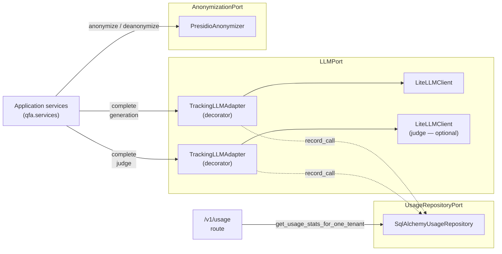

# Components

The hexagonal layout has three ports, a set of application services, and a composition root that wires them together.

## Ports and adapters


```mermaid
flowchart LR
    svc["Application services<br/>(qfa.services)"]

    subgraph llmport["LLMPort"]
        direction TB
        tracking["TrackingLLMAdapter<br/>(decorator)"]
        litellm["LiteLLMClient"]
        tracking --> litellm
        judgetracking["TrackingLLMAdapter<br/>(decorator)"]
        judgelitellm["LiteLLMClient<br/>(judge — optional)"]
        judgetracking --> judgelitellm
    end

    subgraph anonport["AnonymizationPort"]
        presidio["PresidioAnonymizer"]
    end

    subgraph usageport["UsageRepositoryPort"]
        sqlrepo["SqlAlchemyUsageRepository"]
    end

    svc -->|complete<br/>generation| tracking
    svc -->|complete<br/>judge| judgetracking
    svc -->|anonymize / deanonymize| presidio
    tracking -.->|record_call| sqlrepo
    judgetracking -.->|record_call| sqlrepo
    routes_usage["/v1/usage<br/>route"] -->|get_usage_stats_for_one_tenant| sqlrepo
```

The judge branch is **optional and off by default**: unless `JUDGE_LLM_MODEL`
is set, a service's judge reference points at the same client as its
generation reference, and the diagram collapses to a single `LLMPort` edge.

| Port | Adapter(s) | What it owns |
|---|---|---|
| {py:class}`~qfa.domain.ports.LLMPort` | {py:class}`~qfa.adapters.llm_client.LiteLLMClient`, always wrapped by {py:class}`~qfa.adapters.tracking_llm.TrackingLLMAdapter` | One method, `complete(system_message, user_message, tenant_id, response_model, timeout)`. Returns `LLMResponse[T_Response]` carrying the structured output plus token counts and cost. {py:class}`~qfa.services.analyze.AnalyzeService`, {py:class}`~qfa.services.summarize.SummarizeService` and {py:class}`~qfa.services.coding.CodingService` each hold **one or two** of these — see [The judge connection](#the-judge-connection). |
| {py:class}`~qfa.domain.ports.AnonymizationPort` | {py:class}`~qfa.adapters.presidio_anonymizer.PresidioAnonymizer` | `anonymize(text) -> (text, mapping)` and `deanonymize(text, mapping) -> text`. The mapping is held in memory for the request lifetime, then discarded. |
| {py:class}`~qfa.domain.ports.UsageRepositoryPort` | {py:class}`~qfa.adapters.usage_repository.SqlAlchemyUsageRepository` | Writes one {py:class}`~qfa.domain.usage_models.LLMCallRecord` per LLM call (from {py:class}`~qfa.adapters.tracking_llm.TrackingLLMAdapter`) and reads aggregate stats (from the `/v1/usage` routes). |
| {py:class}`~qfa.domain.ports.EmbeddingPort` | {py:class}`~qfa.adapters.embedding.BgeM3OnnxEmbedder` | One method, `embed(texts) -> vectors`. Multilingual dense embeddings (BGE-M3 ONNX-int8, dense-1024-d, in-process, CPU-only). Used only by `mode=hierarchical`. See [ADR-014](../adr/014-embedding-port-and-self-hosted-model.md). |

The tracking decorator is the only place hex's "stack adapters at the composition root" earns its keep — {py:class}`~qfa.adapters.tracking_llm.TrackingLLMAdapter` is itself an {py:class}`~qfa.domain.ports.LLMPort`, so a service never knows whether tracking is on.

### The judge connection

{py:class}`~qfa.services.analyze.AnalyzeService`,
{py:class}`~qfa.services.summarize.SummarizeService` and
{py:class}`~qfa.services.coding.CodingService` can each hold a
**second** {py:class}`~qfa.domain.ports.LLMPort` used only for LLM-as-judge
quality scores, so the model that writes an output is not the model that
grades it. It is configured by `JUDGE_LLM_*` (see the
[settings reference](../operations/settings-reference.md)) and off by default:
with `JUDGE_LLM_MODEL` unset the judge reference simply *is* the generation
client, and behaviour is identical to a single-client deployment. Deployed
environments do configure it, to `mistral-medium-3-5` — see
[ADR-020](../adr/020-mistral-medium-as-judge-model.md).

Five call sites use the judge connection — the `analyze` judge and the
hierarchical leaf judges (on {py:class}`~qfa.services.analyze.AnalyzeService`),
the judges in `summarize` and `summarize_bulk` (on
{py:class}`~qfa.services.summarize.SummarizeService`), and the per-level judge
in `assign_codes` (on {py:class}`~qfa.services.coding.CodingService`, added by
#310). The coding one is the only site whose call count scales with the
request: one judge call per level per selected path, so it can dominate judge
volume. Everything else — analysis, hierarchical map and reduce, summary
generation, and the one-shot coding *pick* — stays on the generation client.

Three properties are worth knowing:

- **Per-field inheritance, resolved once.**
  {py:func}`~qfa.api.composition.resolve_judge_llm_settings` merges the
  `JUDGE_LLM_*` overrides onto the primary `LLMSettings` before either client
  is built, so no `judge or primary` fallback is repeated at a call site. An
  unset judge field keeps the primary's value — including the API key, which
  is why adding a judge needs no new secret.
- **Both clients are tracked identically.** The lifespan wraps the judge client
  in its own {py:class}`~qfa.adapters.tracking_llm.TrackingLLMAdapter` over the
  *same* usage repository. An unwrapped judge client would work fine and
  silently record nothing.
- **One concurrency bound, not two.** In the hierarchical pipeline the shared
  semaphore caps total in-flight calls across map, leaf judge and reduce,
  regardless of which client serves them.

This is [ADR-004](../adr/004-single-llm-client.md) applied, not contradicted:
one client *class* serves every provider, and provider/model selection happens
at startup in the composition root. Two {py:class}`~qfa.adapters.llm_client.LiteLLMClient`
instances differing by model and base URL are exactly that pattern.

Two pieces of the hierarchical (`mode=hierarchical`) path are deterministic
in-process computation with no external dependency, so they live in
`qfa.services` with no port: {py:func}`~qfa.services.clustering.cluster_records`
(HDBSCAN clustering + token-budget chunking, guaranteeing every record lands
in exactly one chunk) and
{py:func}`~qfa.services.coding_trends.build_coding_trend_table` (a non-LLM
code-by-period count fed into the reduce prompt as a faithfulness anchor). The
{py:class}`~qfa.services.analyze.AnalyzeService`'s `analyze_hierarchical`
composes embed -> cluster -> map -> reduce,
recursing when a chunk or the combined partials overflow the token budget. See
[Hierarchical analysis](07-hierarchical-analysis.md) for the full algorithm,
the rationale, and flow/sequence diagrams.

## The application services

Each use case is one async method backing one HTTP endpoint:

| Service | Method | Endpoint | Provider | What it does |
|---|---|---|---|---|
| {py:class}`~qfa.services.analyze.AnalyzeService` | `analyze_bulk` | `POST /v1/analyze-bulk` (`mode=single_pass`) | `get_analyze_service` | One LLM call. Free-text summary of themes across submitted records. |
| {py:class}`~qfa.services.analyze.AnalyzeService` | `analyze_hierarchical` | `POST /v1/analyze-bulk` (`mode=hierarchical`) | `get_analyze_service` | Embed -> cluster -> map -> reduce pipeline. Returns additional `confidence` and `coding_trends` fields. |
| {py:class}`~qfa.services.summarize.SummarizeService` | `summarize` | `POST /v1/summarize` | `get_summarize_service` | One LLM call plus a judge call. Per-record summary with a quality score. |
| {py:class}`~qfa.services.summarize.SummarizeService` | `summarize_bulk` | `POST /v1/summarize-bulk` | `get_summarize_service` | One LLM call plus a judge call. One aggregate summary, themes ordered by frequency. |
| {py:class}`~qfa.services.coding.CodingService` | `assign_codes` | `POST /v1/assign-codes` | `get_coding_service` | One LLM call picks the best-fitting code path(s) directly from the whole flattened coding framework, then a separate judge call per level scores each selected path, root to leaf. |
| {py:class}`~qfa.services.sensitivity.SensitivityService` | `detect_sensitive_content` | `POST /v1/detect-sensitive` | `get_sensitivity_service` | One LLM call per record. Detects sensitive content and categorizes sensitivity types. |

`/v1/summarize`, `/v1/assign-codes`, and `/v1/detect-sensitive` are non-bulk endpoints with per-record outputs. `/v1/analyze-bulk` and `/v1/summarize-bulk` are bulk endpoints and return one aggregate result per request (for `/v1/analyze-bulk`, in both `mode=single_pass` and `mode=hierarchical`).

Epic #112 moved each use case out of the one `Orchestrator` god class and into its own service, per [ADR-017](../adr/017-orchestrator-composition-only.md); #267 deleted the emptied-out class once nothing referenced it any more. {py:class}`~qfa.services.sensitivity.SensitivityService`, {py:class}`~qfa.services.coding.CodingService`, {py:class}`~qfa.services.analyze.AnalyzeService` and {py:class}`~qfa.services.summarize.SummarizeService` are the four extracted services: each holds its use case's logic, takes the LLM connection, the anonymiser and the shared {py:class}`~qfa.services.llm_call_executor.LLMCallExecutor` as constructor dependencies, and has **no base class**.

The split is visible at the route: each service has its own provider in `qfa.api.dependencies` (the Provider column above), and a handler annotates against the single service it calls — so which use cases a route can reach is readable from its signature.

Each method is pure use-case logic — no scope or correlation plumbing. `call_scope` is entered by a FastAPI dependency declared on the route (`Depends(call_scope_for(Operation.X))`), so by the time a service method runs `current_call_context` is already set. See [Cross-cutting concerns](04-crosscutting.md) for the full picture.

`AnalyzeService` holds *both* analyse modes because they are two modes of one
endpoint, selected on the request, and they share the retained-placeholder
guardrail (`_ANALYZE_RETAINED_PLACEHOLDER_TYPES`) that must stay in one place. It
is also the only service that takes an {py:class}`~qfa.domain.ports.EmbeddingPort`
— an explicit dependency on the one service that needs it, rather than on a
constructor shared by use cases that do not.

`SummarizeService` likewise holds two methods across two endpoints: both are one
generation call plus one judge call over the same prompt and hyperlinking
conventions, differing only in bulk vs. single-record shape.

### The LLM-call executor

The scaffolding every use case wraps its LLM calls in lives on one collaborator, {py:class}`~qfa.services.llm_call_executor.LLMCallExecutor`, which each service holds as `self._executor` and delegates to. The composition root builds **one** instance and hands the same object to every service:

| Method | Concern |
|---|---|
| `check_deadline_and_get_timeout(deadline)` | Derive the per-call timeout from the remaining request budget; raise {py:exc}`~qfa.domain.errors.AnalysisTimeoutError` when too little time is left |
| `check_token_limit(system_message, user_message)` | Pre-flight token estimate; raise {py:exc}`~qfa.domain.errors.FeedbackTooLargeError` when over `LLM_MAX_TOTAL_TOKENS` |
| `anonymize_records(records, anonymize)` | Redact each record's text, returning new records plus the merged restore mapping |
| `anonymize_text(text)` | Redact one assembled message, returning the redacted text plus its restore mapping |
| `deanonymize_json(payload, mapping)` | Restore redacted values inside a serialized JSON response, escaping them so the payload stays valid JSON |
| `complete(…)` | One completion bounded by the deadline; used by the single-call use cases |
| `bounded_complete(semaphore, …)` | `complete` run under a concurrency semaphore, with queue-wait timing; used by the hierarchical map/judge/reduce phases |

It is a **plain concrete class** — not a Protocol, not a base class, and not declared in `qfa.domain.ports`. It wraps no external system, so it is not a port; and behaviour reuse in this codebase is always composition, so nothing inherits from it. Both points are decided in [ADR-017: Decompose the Orchestrator by composition only](../adr/017-orchestrator-composition-only.md), which is also why the composition root injects the executor rather than letting each service construct its own. There is exactly **one** executor instance per process, shared by every service.

The executor is built over the **primary** LLM connection. Judge calls that must run on the second connection pass it per call (`bounded_complete(..., llm=self._judge_llm)`); omitting the argument uses the primary.

Tests construct the real executor over the existing `FakeLLMPort` / `FakeAnonymizer` doubles (`tests/services/test_llm_call_executor.py`) — there is no fake executor to keep in sync.

## Composition root

`qfa.api.app.create_app()` builds the FastAPI instance; the `lifespan` context manager wires the dependency graph at startup. The wiring splits into two halves:

- **Infrastructure half** (in `qfa.api.app`): load settings, build the base LLM client — plus a second one for judge calls when `JUDGE_LLM_MODEL` is set — create the async DB engine, wrap each LLM in {py:class}`~qfa.adapters.tracking_llm.TrackingLLMAdapter` for usage tracking, set up the auth adapter, build the embedder (logging its construction so operators see it on startup).
- **Domain half** (in {py:func}`qfa.api.composition.build_services`): given settings plus the already-wrapped LLM and embedder, construct the {py:class}`~qfa.adapters.presidio_anonymizer.PresidioAnonymizer` and the {py:class}`~qfa.services.llm_call_executor.LLMCallExecutor`, register custom model prices with LiteLLM, and assemble every application service over that one executor. The services come back together as a {py:class}`~qfa.api.composition.ServiceGraph` — one field per service — which is what makes the sharing structural rather than a convention each call site has to remember.

The lifespan then attaches each service (`app.state.sensitivity_service`, `app.state.coding_service`, `app.state.analyze_service`, `app.state.summarize_service`), the API keys, and the usage repository to `app.state` for the request lifecycle to read. One `app.state` slot per service is what lets each route's provider inject only the use case it needs.

The split exists so callers outside the API server — scripts, notebooks, ad-hoc evaluation harnesses — can construct the services over a plain LLM client with a single call ({py:func}`~qfa.api.composition.build_analyze_service` is the narrow wrapper over `build_services` for exactly that case):

```python
from qfa.api.composition import build_analyze_service
from qfa.settings import AppSettings

analyze = build_analyze_service(AppSettings())
```

`build_services` (and its single-service wrapper `build_analyze_service`) is intentionally pure with respect to the API server's runtime concerns: it does not touch the database, does not wrap the LLM in `TrackingLLMAdapter`, and does not read auth keys. The FastAPI lifespan keeps those concerns and passes the wrapped clients in via the `llm=` and `judge_llm=` keywords. See `notebooks/analyze_corpus.ipynb` for an example.

This is the **only** place that knows about concrete adapter classes. Routes and dependencies read from `app.state` only.

## Test seam

`create_app(llm_factory=…)` lets end-to-end tests inject a `FakeLLMPort` without monkey-patching. The lifespan still runs — so the *real* {py:class}`~qfa.adapters.tracking_llm.TrackingLLMAdapter`, {py:class}`~qfa.adapters.presidio_anonymizer.PresidioAnonymizer`, and migrations all execute. Only the bottom-most layer (the actual LLM call) is faked. See `tests/e2e/conftest.py`.
