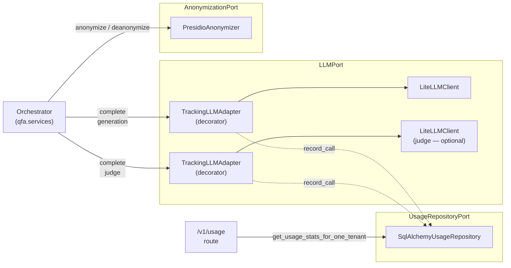

# Components

The hexagonal layout has three ports, one application service, and a composition root that wires them together.

## Ports and adapters


```mermaid
flowchart LR
    orch["Orchestrator<br/>(qfa.services)"]

    subgraph llmport["LLMPort"]
        direction TB
        tracking["TrackingLLMAdapter<br/>(decorator)"]
        litellm["LiteLLMClient"]
        tracking --> litellm
        judgetracking["TrackingLLMAdapter<br/>(decorator)"]
        judgelitellm["LiteLLMClient<br/>(judge — optional)"]
        judgetracking --> judgelitellm
    end

    subgraph anonport["AnonymizationPort"]
        presidio["PresidioAnonymizer"]
    end

    subgraph usageport["UsageRepositoryPort"]
        sqlrepo["SqlAlchemyUsageRepository"]
    end

    orch -->|complete<br/>generation| tracking
    orch -->|complete<br/>judge| judgetracking
    orch -->|anonymize / deanonymize| presidio
    tracking -.->|record_call| sqlrepo
    judgetracking -.->|record_call| sqlrepo
    routes_usage["/v1/usage<br/>route"] -->|get_usage_stats_for_one_tenant| sqlrepo
```

The judge branch is **optional and off by default**: unless `JUDGE_LLM_MODEL`
is set, the orchestrator's judge reference points at the same client as its
generation reference, and the diagram collapses to a single `LLMPort` edge.

| Port | Adapter(s) | What it owns |
|---|---|---|
| {py:class}`~qfa.domain.ports.LLMPort` | {py:class}`~qfa.adapters.llm_client.LiteLLMClient`, always wrapped by {py:class}`~qfa.adapters.tracking_llm.TrackingLLMAdapter` | One method, `complete(system_message, user_message, tenant_id, response_model, timeout)`. Returns `LLMResponse[T_Response]` carrying the structured output plus token counts and cost. The orchestrator holds **one or two** of these — see [The judge connection](#the-judge-connection). |
| {py:class}`~qfa.domain.ports.AnonymizationPort` | {py:class}`~qfa.adapters.presidio_anonymizer.PresidioAnonymizer` | `anonymize(text) -> (text, mapping)` and `deanonymize(text, mapping) -> text`. The mapping is held in memory for the request lifetime, then discarded. |
| {py:class}`~qfa.domain.ports.UsageRepositoryPort` | {py:class}`~qfa.adapters.usage_repository.SqlAlchemyUsageRepository` | Writes one {py:class}`~qfa.domain.usage_models.LLMCallRecord` per LLM call (from {py:class}`~qfa.adapters.tracking_llm.TrackingLLMAdapter`) and reads aggregate stats (from the `/v1/usage` routes). |
| {py:class}`~qfa.domain.ports.EmbeddingPort` | {py:class}`~qfa.adapters.embedding.BgeM3OnnxEmbedder` | One method, `embed(texts) -> vectors`. Multilingual dense embeddings (BGE-M3 ONNX-int8, dense-1024-d, in-process, CPU-only). Used only by `mode=hierarchical`. See [ADR-014](../adr/014-embedding-port-and-self-hosted-model.md). |

The tracking decorator is the only place hex's "stack adapters at the composition root" earns its keep — {py:class}`~qfa.adapters.tracking_llm.TrackingLLMAdapter` is itself an {py:class}`~qfa.domain.ports.LLMPort`, so the orchestrator never knows whether tracking is on.

### The judge connection

The orchestrator can hold a **second** {py:class}`~qfa.domain.ports.LLMPort`
used only for LLM-as-judge quality scores, so the model that writes an output
is not the model that grades it. It is configured by `JUDGE_LLM_*` (see the
[settings reference](../operations/settings-reference.md)) and off by default:
with `JUDGE_LLM_MODEL` unset the judge reference simply *is* the generation
client, and behaviour is identical to a single-client deployment.

Four call sites use the judge connection — the `analyze` judge, the
hierarchical leaf judges, and the judges in `summarize` and
`summarize_aggregate`. Everything else (analysis, hierarchical map and reduce,
summary generation, and the whole of `assign_codes` including its per-level
judge) stays on the generation client.

Three properties are worth knowing:

- **Per-field inheritance, resolved once.**
  {py:func}`~qfa.api.composition.resolve_judge_llm_settings` merges the
  `JUDGE_LLM_*` overrides onto the primary `LLMSettings` before either client
  is built, so no `judge or primary` fallback is repeated at a call site. An
  unset judge field keeps the primary's value — including the API key, which
  is why adding a judge needs no new secret.
- **Both clients are tracked identically.** The lifespan wraps the judge client
  in its own {py:class}`~qfa.adapters.tracking_llm.TrackingLLMAdapter` over the
  *same* usage repository. An unwrapped judge client would work fine and
  silently record nothing.
- **One concurrency bound, not two.** In the hierarchical pipeline the shared
  semaphore caps total in-flight calls across map, leaf judge and reduce,
  regardless of which client serves them.

This is [ADR-004](../adr/004-single-llm-client.md) applied, not contradicted:
one client *class* serves every provider, and provider/model selection happens
at startup in the composition root. Two {py:class}`~qfa.adapters.llm_client.LiteLLMClient`
instances differing by model and base URL are exactly that pattern.

Two pieces of the hierarchical (`mode=hierarchical`) path are deterministic
in-process computation with no external dependency, so they live in
`qfa.services` with no port: {py:func}`~qfa.services.clustering.cluster_records`
(HDBSCAN clustering + token-budget chunking, guaranteeing every record lands
in exactly one chunk) and
{py:func}`~qfa.services.coding_trends.build_coding_trend_table` (a non-LLM
code-by-period count fed into the reduce prompt as a faithfulness anchor). The
orchestrator's `analyze_hierarchical` composes embed -> cluster -> map -> reduce,
recursing when a chunk or the combined partials overflow the token budget. See
[Hierarchical analysis](07-hierarchical-analysis.md) for the full algorithm,
the rationale, and flow/sequence diagrams.

## The orchestrator

{py:class}`~qfa.services.orchestrator.Orchestrator` is one class with five async methods, each backing one HTTP endpoint:

| Method | Endpoint | What it does |
|---|---|---|
| `analyze` | `POST /v1/analyze` (`mode=single_pass`) | One LLM call. Free-text summary of themes across submitted records. |
| `analyze_hierarchical` | `POST /v1/analyze` (`mode=hierarchical`) | Embed -> cluster -> map -> reduce pipeline. Returns additional `confidence` and `coding_trends` fields. |
| `summarize` | `POST /v1/summarize` | One LLM call. Per-record summaries with a self-evaluated quality score. |
| `assign_codes` | `POST /v1/assign-codes` | One LLM call per record. The classifier picks the best-fitting code path(s) directly from the whole flattened coding framework and self-reports a confidence score for each. |
| `detect_sensitive_content` | `POST /v1/detect-sensitive` | One LLM call per record. Detects sensitive content and categorizes sensitivity types. |

`/v1/summarize`, `/v1/assign-codes`, and `/v1/detect-sensitive` are non-bulk endpoints with per-record outputs. `/v1/analyze` is the bulk endpoint and returns one aggregate result per request (for both `mode=single_pass` and `mode=hierarchical`).

Each method is pure use-case logic — no scope or correlation plumbing. `call_scope` is entered by a FastAPI dependency declared on the route (`Depends(call_scope_for(Operation.X))`), so by the time an orchestrator method runs `current_call_context` is already set. See [Cross-cutting concerns](04-crosscutting.md) for the full picture.

## Composition root

`qfa.api.app.create_app()` builds the FastAPI instance; the `lifespan` context manager wires the dependency graph at startup. The wiring splits into two halves:

- **Infrastructure half** (in `qfa.api.app`): load settings, build the base LLM client — plus a second one for judge calls when `JUDGE_LLM_MODEL` is set — create the async DB engine, wrap each LLM in {py:class}`~qfa.adapters.tracking_llm.TrackingLLMAdapter` for usage tracking, set up the auth adapter, build the embedder (logging its construction so operators see it on startup).
- **Domain half** (in {py:func}`qfa.api.composition.build_orchestrator`): given settings plus the already-wrapped LLM and embedder, construct the {py:class}`~qfa.adapters.presidio_anonymizer.PresidioAnonymizer`, register custom model prices with LiteLLM, and assemble the {py:class}`~qfa.services.orchestrator.Orchestrator`.

The lifespan then attaches the orchestrator, API keys, and the usage repository to `app.state` for the request lifecycle to read.

The split exists so callers outside the API server — scripts, notebooks, ad-hoc evaluation harnesses — can construct an `Orchestrator` over a plain LLM client with a single call:

```python
from qfa.api.composition import build_orchestrator
from qfa.settings import AppSettings

orchestrator = build_orchestrator(AppSettings())
```

`build_orchestrator` is intentionally pure with respect to the API server's runtime concerns: it does not touch the database, does not wrap the LLM in `TrackingLLMAdapter`, and does not read auth keys. The FastAPI lifespan keeps those concerns and passes the wrapped clients in via the `llm=` and `judge_llm=` keywords. See `notebooks/analyze_corpus.ipynb` for an example.

This is the **only** place that knows about concrete adapter classes. Routes and dependencies read from `app.state` only.

## Test seam

`create_app(llm_factory=…)` lets end-to-end tests inject a `FakeLLMPort` without monkey-patching. The lifespan still runs — so the *real* {py:class}`~qfa.adapters.tracking_llm.TrackingLLMAdapter`, {py:class}`~qfa.adapters.presidio_anonymizer.PresidioAnonymizer`, and migrations all execute. Only the bottom-most layer (the actual LLM call) is faked. See `tests/e2e/conftest.py`.
