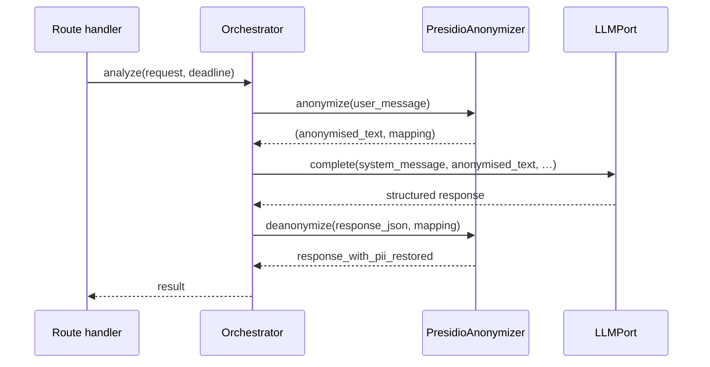

# Cross-cutting concerns

Things that don't belong to a single component — they show up at multiple layers.

## Anonymisation round-trip

For every operation that reaches the LLM, the orchestrator wraps the user-facing text in an anonymise → call → de-anonymise sandwich:

Notes:

- The mapping lives in memory for the request and is discarded when the orchestrator method returns.
- The de-anonymise step runs over the serialised response — substitutions are textual, so the round-trip is a string replacement, not a structured walk.

## Call context and usage tracking

`qfa.services.call_context` defines a `ContextVar[CallContext | None]` and a `call_scope(tenant_id, operation)` async context manager. Every public orchestrator method enters a scope; the {py:class}`~qfa.adapters.tracking_llm.TrackingLLMAdapter` reads the context to attribute each LLM call to a tenant and operation.

Consequence: any new code path that calls `LLMPort.complete` outside an orchestrator method will raise {py:exc}`~qfa.domain.errors.MissingCallScopeError` at runtime. The tracking adapter refuses to record an untyped call.

## Deadlines, timeouts, retries

| Layer | Concern | Mechanism |
|---|---|---|
| Route handler | Per-request deadline | `deadline = now(UTC) + 120s`, passed as an absolute `datetime` into the orchestrator |
| Orchestrator | Deadline check | Before each LLM call: if remaining time is negative, raise {py:exc}`~qfa.domain.errors.AnalysisTimeoutError` |
| Adapter ({py:class}`~qfa.adapters.llm_client.LiteLLMClient`) | Retry on transient errors | `tenacity.retry` with exponential backoff (1s→10s, 60s budget) for {py:exc}`~qfa.domain.errors.LLMTimeoutError` and {py:exc}`~qfa.domain.errors.LLMRateLimitError` |
| Adapter ({py:class}`~qfa.adapters.llm_client.LiteLLMClient`) | Per-call timeout | Passed through to `litellm.acompletion(timeout=…)` |
| Adapter ({py:class}`~qfa.adapters.llm_client.LiteLLMClient`) | Token budget guard | Estimates `len(text) / chars_per_token`; raises {py:exc}`~qfa.domain.errors.FeedbackTooLargeError` if over `LLM_MAX_TOTAL_TOKENS` |

Retry policy and token budget belong to the adapter because both are model-specific (different LiteLLM-routed models have different context windows and rate-limit behaviour).

## Error → HTTP mapping

The exception handlers in `qfa.api.app` translate domain errors into HTTP responses:

| Exception | HTTP | `error.code` |
|---|---|---|
| Missing / invalid bearer token | 401 | `authentication_required` |
| Pydantic validation failure | 422 | `validation_error` |
| {py:exc}`~qfa.domain.errors.FeedbackTooLargeError` | 413 | `payload_too_large` |
| {py:exc}`~qfa.domain.errors.AnalysisTimeoutError` | 504 | `analysis_timeout` |
| {py:exc}`~qfa.domain.errors.AnalysisError` (with "injection" in message) | 422 | `prompt_injection_detected` |
| {py:exc}`~qfa.domain.errors.AnalysisError` (other) | 502 | `analysis_unavailable` |
| {py:exc}`~qfa.domain.errors.LLMError` | 502 | `llm_unavailable` |
| `UsageRepositoryUnavailableError` | 503 | `usage_backend_unavailable` |
| Usage tracking disabled | 503 | `usage_tracking_disabled` |
| Unhandled `Exception` | 500 | `internal_error` |

All responses share the same envelope shape with a server-generated `request_id`.

## Logging policy

Hard prohibitions — **never log at any level**:

- Feedback record content (`record.text` / `record.content`)
- User prompt (`request.prompt`) — log the character count instead
- Assembled system or user messages sent to the LLM
- LLM response text
- API key values (protected by `SecretStr`)

Safe to log: `request_id`, `tenant_id`, `operation`, record counts, estimated tokens, attempt numbers, model name, durations, HTTP status codes, `prompt_tokens`, `completion_tokens`, cost.

See [Observability](../operations/observability.md) for what each log statement looks like at runtime.
