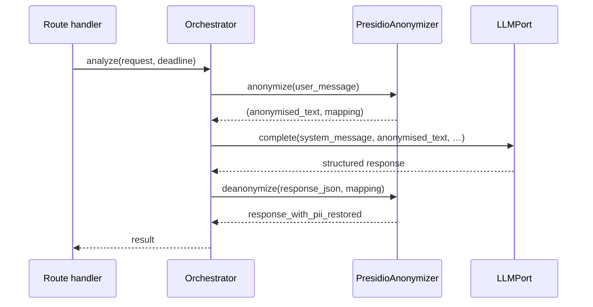
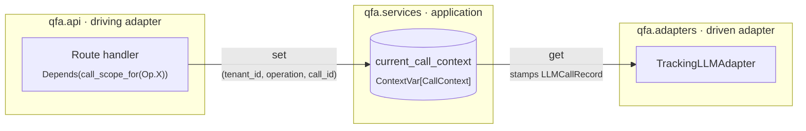

# Cross-cutting concerns

Things that don't belong to a single component — they show up at multiple layers.

## Anonymisation round-trip

For every operation that reaches the LLM, the orchestrator wraps the user-facing text in an anonymise → call → de-anonymise sandwich:



Notes:

- The mapping lives in memory for the request and is discarded when the orchestrator method returns.
- The de-anonymise step runs over the serialised response — substitutions are textual, so the round-trip is a string replacement, not a structured walk.

## Call context and usage tracking

`qfa.services.call_context` defines a single `ContextVar[CallContext | None]` named `current_call_context`, plus an async context-manager helper `call_scope(tenant_id, operation, request_id)` that sets and resets it. The `CallContext` it holds carries `tenant_id`, `operation`, and `call_id` (the correlation UUID) for the duration of one orchestrator invocation. The {py:class}`~qfa.adapters.tracking_llm.TrackingLLMAdapter` reads it when persisting each LLM call so every row in `llm_calls` is attributed to the right tenant, operation, and API invocation.

`call_scope` is entered by a FastAPI dependency at the driving-adapter layer, **not** by the orchestrator. Each route declares which operation it represents:

```python
async def analyze(
    ...,
    _scope: CallContext = Depends(call_scope_for(Operation.ANALYZE)),
): ...
```

`call_scope_for` lives in `qfa.api.dependencies`. It composes with `authenticate_request` (to resolve the tenant) and reads `request.state.request_id` (set by `RequestIdMiddleware` on the way in, also returned to the client as the `X-Request-ID` header). It then enters `call_scope(tenant_id, operation, request_id=…)` before the route body — and the orchestrator beneath it — runs. The orchestrator is therefore free of scope plumbing; it's pure use-case logic that happens to execute under an ambient context the tracking adapter reads.

Because `call_scope` receives `request_id` as an explicit argument, the header value, the log lines, and the `llm_calls.call_id` rows always share one UUID by construction — no second ContextVar, no priority chain, no fallback.

Non-HTTP callers (CLI, future jobs, ad-hoc tests) generate a UUID themselves and pass it: `async with call_scope(tenant, operation, request_id=uuid4()): …`.

If `LLMPort.complete` is invoked outside an active `call_scope` (e.g. a wiring bug), `TrackingLLMAdapter` does **not** raise — it logs at ERROR, routes through to the inner LLM, and returns the response without persisting the attempt. Observability never breaks the use case; missing scope is loud in logs and alertable, but does not fail user-facing requests.

Conceptually: the driving adapter writes the ContextVar; the driven adapter reads it. The orchestrator in between never touches it.



Both adapters depend on `qfa.services.call_context`; neither depends on the other. The ContextVar is set on request entry and reset on exit, so successive requests in one event loop never leak state across each other.

## Deadlines, timeouts, retries

| Layer | Concern | Mechanism |
|---|---|---|
| Route handler | Per-request deadline | `deadline = now(UTC) + 120s`, passed as an absolute `datetime` into the orchestrator |
| Orchestrator | Deadline check | Before each LLM call: if remaining time is negative, raise {py:exc}`~qfa.domain.errors.AnalysisTimeoutError` |
| Adapter ({py:class}`~qfa.adapters.llm_client.LiteLLMClient`) | Retry on transient errors | `tenacity.retry` with exponential backoff (1s→10s, 60s budget) for {py:exc}`~qfa.domain.errors.LLMTimeoutError` and {py:exc}`~qfa.domain.errors.LLMRateLimitError` |
| Adapter ({py:class}`~qfa.adapters.llm_client.LiteLLMClient`) | Per-call timeout | Passed through to `litellm.acompletion(timeout=…)` |
| Adapter ({py:class}`~qfa.adapters.llm_client.LiteLLMClient`) | Token budget guard | Estimates `len(text) / chars_per_token`; raises {py:exc}`~qfa.domain.errors.FeedbackTooLargeError` if over `LLM_MAX_TOTAL_TOKENS` |

Retry policy and token budget belong to the adapter because both are model-specific (different LiteLLM-routed models have different context windows and rate-limit behaviour).

## Error → HTTP mapping

The exception handlers in `qfa.api.app` translate domain errors into HTTP responses:

| Exception | HTTP | `error.code` |
|---|---|---|
| Missing / invalid bearer token | 401 | `authentication_required` |
| Pydantic validation failure | 422 | `validation_error` |
| {py:exc}`~qfa.domain.errors.FeedbackTooLargeError` | 413 | `payload_too_large` |
| {py:exc}`~qfa.domain.errors.AnalysisTimeoutError` | 504 | `analysis_timeout` |
| {py:exc}`~qfa.domain.errors.AnalysisError` (with "injection" in message) | 422 | `prompt_injection_detected` |
| {py:exc}`~qfa.domain.errors.AnalysisError` (other) | 502 | `analysis_unavailable` |
| {py:exc}`~qfa.domain.errors.LLMError` | 502 | `llm_unavailable` |
| `UsageRepositoryUnavailableError` | 503 | `usage_backend_unavailable` |
| Unhandled `Exception` | 500 | `internal_error` |

All responses share the same envelope shape with a server-generated `request_id`.

## Logging policy

Hard prohibitions — **never log at any level**:

- Feedback record content (`record.text` / `record.content`)
- User prompt (`request.prompt`) — log the character count instead
- Assembled system or user messages sent to the LLM
- LLM response text
- API key values (protected by `SecretStr`)

Safe to log: `request_id`, `tenant_id`, `operation`, record counts, estimated tokens, attempt numbers, model name, durations, HTTP status codes, `prompt_tokens`, `completion_tokens`, cost.

See [Observability](../operations/observability.md) for what each log statement looks like at runtime.
