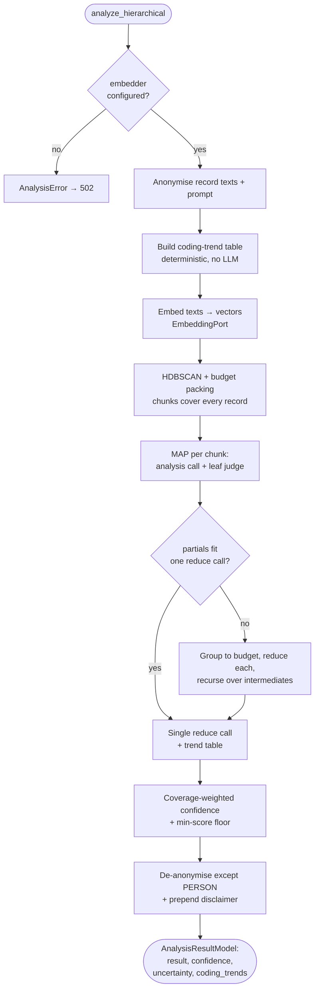
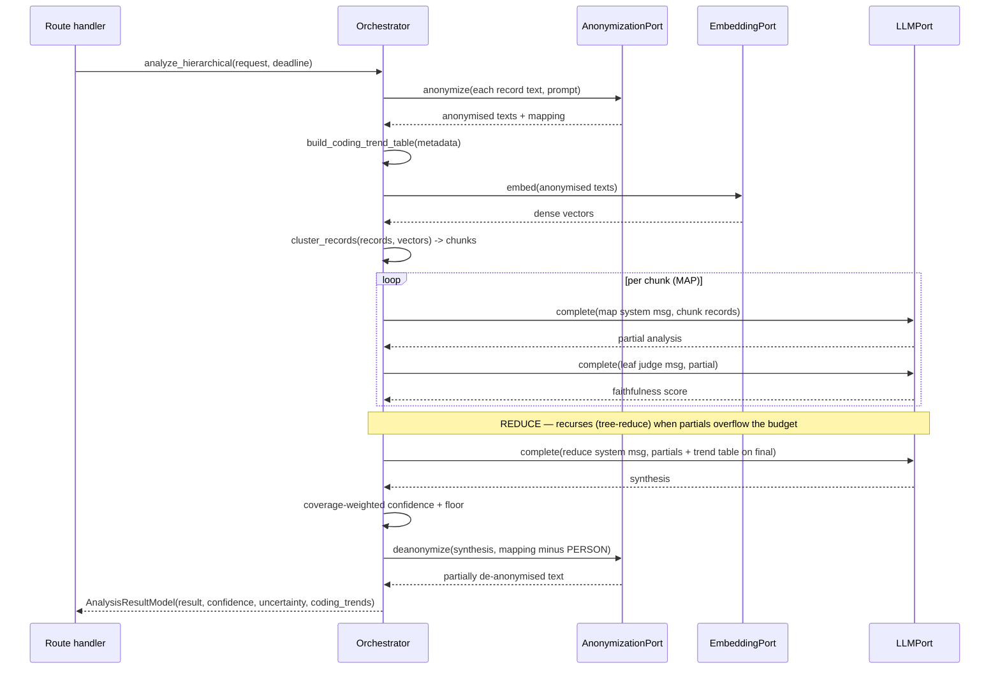

# Hierarchical analysis (`mode=hierarchical`)

How `POST /v1/analyze` analyses a corpus that is too large for a single LLM
call, without dropping any record.

`single_pass` (the #117 default) sends every record in one prompt and is
guarded by a token cap — input over the cap returns **413 `payload_too_large`**.
`hierarchical` lifts that ceiling: it embeds and clusters the records into
thematically coherent, budget-sized chunks, analyses each chunk (**map**), and
synthesises the partial analyses into one answer (**reduce**), recursing when
the work still overflows the budget.

The two modes are selected by the `mode` request field; the route handler calls
`Orchestrator.analyze` or `Orchestrator.analyze_hierarchical` accordingly — one
orchestrator, one method per mode (see
[ADR-011](../adr/011-drop-orchestrator-port.md)).

## Why an embedding model at all?

Clustering needs a vector per record so that records about the same theme sit
near each other. The model must be **multilingual** — humanitarian feedback
arrives in many languages, and a monolingual model would cluster by language
rather than theme. The model is the only external, swappable dependency in the
path, so it sits behind {py:class}`~qfa.domain.ports.EmbeddingPort`. The choice
of a *self-hosted BGE-M3 ONNX-int8* model over a hosted embedding API — and why
that specific model and format — is recorded in
[ADR-014](../adr/014-embedding-port-and-self-hosted-model.md).

## The pipeline

`Orchestrator.analyze_hierarchical` runs these steps in order:

1. **Availability guard.** If no embedder is configured (`EMBEDDING_*` unset),
   the call raises `AnalysisError` → **502 `analysis_unavailable`**. A
   deployment that never uses `hierarchical` carries no model on disk.
2. **Anonymise first.** Every record's *text* is anonymised, and so is the
   analyst prompt, **before** anything leaves the record — i.e. before embedding
   and before any LLM call. Record *metadata* is left untouched (codes and dates
   are not PII and feed step 3).
3. **Coding-trend table (deterministic, no LLM).**
   {py:func}`~qfa.services.coding_trends.build_coding_trend_table` counts the
   coding labels in the records' metadata per time period, producing a
   code-by-period frequency table. Because it is exact arithmetic over the
   metadata it is fully faithful — it cannot hallucinate. It later anchors the
   reduce step and is returned to the caller as `coding_trends`. The same
   table is also built and returned by `mode=single_pass` — it depends only
   on input metadata, not on the chunking pipeline, so there is no reason to
   gate it on the mode. Granularity (`day` / `week` / `month`, default `week`)
   is configurable via the request body's `period` field, with a server-side
   default from `ANALYZE_DEFAULT_CODING_TREND_PERIOD`.
4. **Embed.** {py:class}`~qfa.domain.ports.EmbeddingPort` turns the anonymised
   texts into dense vectors. Encoding is synchronous CPU-bound computation, not
   I/O — see the port's design rationale in ADR-014.
5. **Cluster into budget chunks.**
   {py:func}`~qfa.services.clustering.cluster_records` runs HDBSCAN over the
   vectors and packs each resulting cluster into one or more chunks that each
   fit the token budget. Outliers (HDBSCAN's noise label `-1`) become
   *uncategorised* chunks rather than being discarded, and a corpus smaller than
   `min_cluster_size` is treated as one uncategorised group. A coverage
   invariant is asserted: the chunks partition the input exactly — **every
   record lands in exactly one chunk, none dropped, none duplicated**. Why
   HDBSCAN and not k-means/DBSCAN: [ADR-015](../adr/015-hdbscan-clustering.md).
6. **Map.** For each chunk, one analysis LLM call (the same guardrailed envelope
   as `single_pass`, built by `build_map_system_message`) is followed by one
   **leaf judge** call that scores how faithful that partial is to *its own
   chunk*. Judging at the leaf is deliberate: the top-level synthesis never sees
   the raw records, so it cannot be scored against them — only the leaves can. A
   failed judge call floors that chunk's score at `0.0` and is still counted, so
   judge failure lowers confidence rather than vanishing.
7. **Reduce.** The partials are synthesised into one analysis. If they fit in
   one reduce call, a single call is made. If they overflow, they are split into
   budget-sized groups, each group is reduced to an intermediate, and the reduce
   **recurses** over the intermediates — a tree-reduce. The trend table is
   attached to the **final** reduce only (intermediates pass `None`) so it
   anchors the top-level answer without being double-counted. A convergence
   safeguard handles the degenerate case where every partial overflows on its
   own: instead of looping forever, it emits one reduce call over all partials.
8. **Confidence.** The per-chunk judge scores are combined into a single
   `confidence` in [0, 1], weighting each chunk by its record count
   (coverage-weighted mean). The lowest single-chunk score is reported as a
   floor in `uncertainty_explanation`, so a small badly-grounded chunk stays
   visible even when the weighted mean is high.
9. **De-anonymise + disclaimer.** As with `analyze`, the synthesis is
   de-anonymised except for `<PERSON_*>` placeholders (see
   [Prompt envelope](06-prompt-envelope.md#selective-de-anonymisation-person-retention)),
   then `ANALYZE_DISCLAIMER` is prepended. The result carries `result`,
   `confidence`, `uncertainty_explanation`, and `coding_trends`.

### Two ways the budget is respected

The token budget is enforced in two distinct places, and it helps to keep them
separate:

- **Map side (splitting).** An over-budget *cluster* is greedily packed into
  several budget-sized chunks during step 5. This is splitting, not recursion.
- **Reduce side (recursion).** An over-budget *set of partials* is tree-reduced
  in step 7. This genuine recursion is what lets the path scale to corpora many
  times the single-call cap.

## Guardrails

The prompt-injection guardrails from [the prompt envelope](06-prompt-envelope.md)
are applied at **both** the map and the reduce prompts (`build_map_system_message`
and `build_reduce_system_message`), so untrusted record text is treated as data
at every LLM hop, not only the first.

## Flow

## Sequence summary

