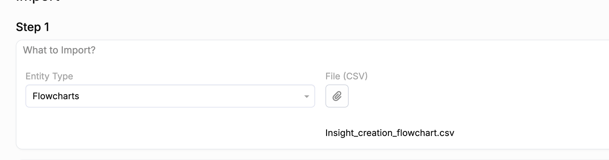

# EspoCRM integration

EspoCRM is the primary upstream feeding feedback records into the service. The integration is one-way: EspoCRM calls the qfa backend's HTTP endpoints; the backend does not call EspoCRM.

## What the scripts do

The code is written in EspoCRM Formula Script, which is a specialized language, very similar to PHP. The files have a `.php` extension, but this is solely for syntax highlighting during development.

Server-side EspoCRM scripts in `scripts/espo_crm/` compose request bodies based on two distinct workflows.

### Single-feedback record script

`scripts/espo_crm/feedback_trigger` contains code that triggers on a feedback record **save**.

These use all single-feedback record endpoints such as `summarize`, `detect-sensitive` and `assign-codes`. These are all executed at once.

> **Note:** The entire coding framework (all codingLevel1, codingLevel2, codingLevel3 items) is sent to the `assign-codes` endpoint. This allows the inference to be stateless.

### Insight saving script

`scripts/espo_crm/insight_trigger` has code that triggers when an insight record is **created**. This flow selects the endpoint that coincides with the user request, and calls one of the bulk endpoints: `analyze-bulk` or `summarize-bulk`.

The two flows build their distinctive `motherPayload` — a JSON object containing all key-value pairs needed by the endpoints. This holds information about the selected feedback item(s) and their attributes. The attributes are saved as metadata in this flow.

## Flowcharts

The two workflows above are implemented as EspoCRM flowcharts, built and maintained inside the EspoCRM UI. Exports of these flowcharts are stored in `scripts/espo_crm/flowcharts/` as CSV files:

- `Feedback_saving_flowchart.csv` — feedback record save trigger
- `Insight_creation_flowchart.csv` — insight creation trigger

These CSV files serve as the versioning mechanism: whenever a flowchart is updated in the EspoCRM UI, export a fresh copy and commit it. Promoting a flowchart to staging or production is then a matter of importing the CSV through the EspoCRM UI.

> **Backend/flowchart deploy independence:** The request `metadata` object accepts a fixed set of keys (`created`, `coding_level_1`, `coding_level_2`, `coding_level_3`) and rejects unknown ones. It also still tolerates a deprecated `feedback_record_id` key that older flowcharts wrote into metadata (it is ignored — the record-level `id` is the identifier the backend uses). Because of this, a new backend can be deployed without importing updated flowcharts first, and vice versa. New flowcharts should not send `feedback_record_id`.

> **Version requirement:** Dynamic API URL selection requires EspoCRM **9.2.3 or higher**. On older versions `QFA_API_BASE_URL` cannot be read from App Secrets at runtime and the URL must be hard-coded in the flowchart. Always upgrade to the latest supported version.

### Exporting a flowchart

1. In EspoCRM, go to **Flowcharts**.
2. Open the folder containing the flowchart you want to export.
3. Select the flowchart and choose **Actions → Export**.
4. Select **CSV format** and check **Export all fields**.
5. Commit the downloaded file to `scripts/espo_crm/flowcharts/`.

### Importing a flowchart

1. In EspoCRM, go to **Import** and select **Flowcharts**.
2. Upload the CSV file from `scripts/espo_crm/flowcharts/`.
3. Under **What to do?**, select **Create & Update** if the flowchart already exists, or **Create Only** for a fresh environment.
4. Click **Next**, then **Run Import**.

## Display output

The `-bulk` responses include a backend-rendered `pretty_output` field — a human-readable text block (quality dots, title, summary) ready to write straight into an EspoCRM field. The formatting lives entirely in the backend, so the scripts do not assemble it.

Its `QUALITY`/`TITLE`/`SUMMARY` headers are localized to the request's `output_language` (the same field that drives the title/summary language). Supported languages are English, French, Spanish, Arabic, Russian, Dutch, and Ukrainian; any other or absent value falls back to English headers. The technical `IDs` label is not localized.

## Authentication

EspoCRM stores the bearer token as a server-side secret. Provisioning and rotation use the standard flow in [API key management](../operations/auth-management.md).

Within your EspoCRM instance, set the following values under _Administration_ → _App Secrets_:

| Secret | Value |
|---|---|
| `QFA_API_BASE_URL` | Base URL of the QFA backend for that environment, e.g. `https://qfa-dev-backend.azurewebsites.net` |
| `QFA_API_KEY` | Bearer token for the QFA instance |
