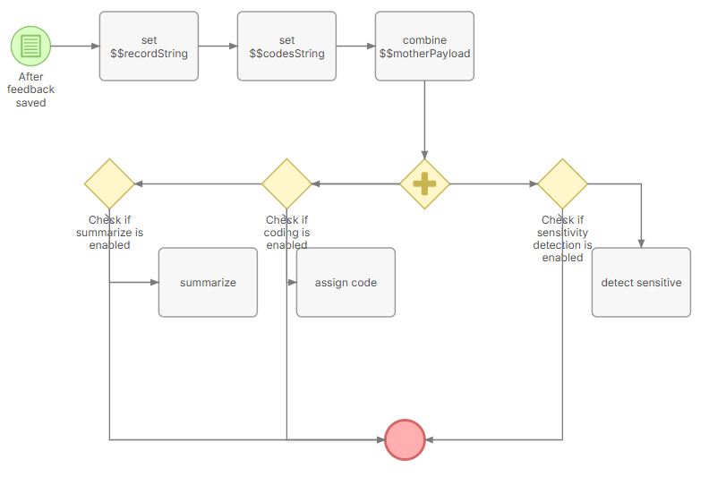
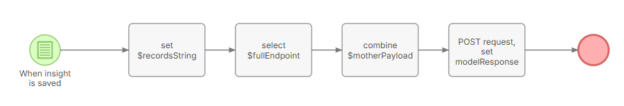

# EspoCRM integration

EspoCRM is the primary upstream feeding feedback records into the service. The integration is one-way: EspoCRM calls the qfa backend's HTTP endpoints; the backend does not call EspoCRM.

## What the scripts do

The code is written in EspoCRM Formula Script, which is a specialized language, very similar to PHP. The files have a `.php` extensions, but this is solely for development highlighting.

Server-side EspoCRM scripts in `scripts/espo_crm/` compose request bodies based on two distinct workflows.

### Single-feedback record script
`scripts/espo_crm/feedback_trigger` contains code that triggers on a feedback record **save**. 

These use all single-feedback record endpoints such as `summarize`, `detect-sensitive` and `assign-codes`. These are all executed at once.

> **Note:** The entire coding framework (all codingLevel1, codingLevel2, codingLevel3 items) is sent to the `assign-codes` endpoint. This allows the inference to be stateless.

### Insight saving script

`scripts/espo_crm/insight_trigger` has code that's triggered when an 
insight record is **created**. This flow selects the endpoint that coincides with the user request, and calls one of the bulk endpoints: `analyze-bulk` or `summarize-bulk`.

The two flows build their distinctive `motherPayload`, which is a a json containing all key-value pairs needed by the endpoints. This holds information about the (selected) feedbackitem(s) and their attributes. 

## Flowcharts

The two workflows above are implemented as EspoCRM flowcharts, built and maintained inside the EspoCRM UI. Exports of these flowcharts are stored in `scripts/espo_crm/flowcharts/` as CSV files:

- `Feedback_saving_flowchart.csv` — feedback record save trigger
- `Insight_creation_flowchart.csv` — insight creation trigger

These CSV files serve as the versioning mechanism: whenever a flowchart is updated, a fresh export should be committed to the repository. Promoting a flowchart to staging or production is then a matter of importing the CSV through the EspoCRM UI.

For the flowcharts to call the backend correctly, two values must be set in _Administration_ → _App Secrets_ of the target EspoCRM instance (see [Authentication](#authentication) below):

- `QFA_API_BASE_URL` — base URL of the QFA backend for that environment, e.g. `https://qfa-dev-backend.azurewebsites.net`
- `QFA_API_KEY` — bearer token for that QFA instance

## Display output

The `-bulk` responses includes a backend-rendered `pretty_output`
field — a human-readable text block (quality dots, title, summary) ready to
write straight into an EspoCRM field. The formatting lives entirely in the
backend, so the scripts do not assemble it.

Its `QUALITY`/`TITLE`/`SUMMARY` headers are localized to the request's
`output_language` (the same field that drives the title/summary language).
Supported languages are English, French, Spanish, Arabic, Russian, Dutch, and
Ukrainian; any other or absent value falls back to English headers. The
technical `IDs` label is not localized.

## Authentication

EspoCRM stores the bearer token as a server-side secret. Provisioning and rotation use the standard flow in [API key management](../operations/auth-management.md). 

> NOTE: Currently, we cannot select the api url dynamically. We need [Espo Version 9.2.3](https://docs.espocrm.com/administration/app-secrets/) to get the secrets from the App secrets dynamically in Espo script.

Within your EspoCRM instance, two values are expected in the _Administration_/_App Secrets_:
- `QFA_API_BASE_URL`| The base URL of QFA, e.g. "https://qfa-dev-backend.azurewebsites.net" ⚠️ Currently not implemented, see note above.
- `QFA_API_KEY` | Bearer token for the QFA instance.