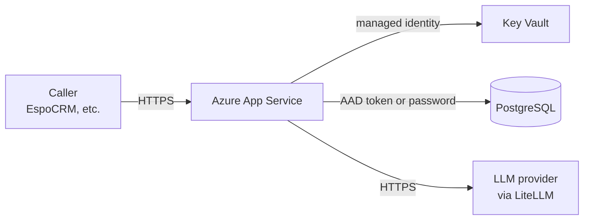

# Deployment

A short overview of how the service runs in production. For provisioning, see [Infrastructure bootstrap](bootstrap.md) and [Set up a new environment](setup-new-env.md).

## Runtime topology

The service runs as a single container on Azure App Service, one App Service plan per environment (`dev`, `staging`, `prd`). The container is built from the Dockerfile in the repo root and pushed to the shared Azure Container Registry by CI.

## Container lifecycle

`entrypoint.sh` runs two things, in order:

1. **`python -m qfa.cli.migrate`** — applies any pending Alembic migrations. Uses a Postgres advisory lock (`pg_advisory_lock(LOCK_KEY)`) scoped to the connection, so concurrent replicas wait for one migrator to finish and a crashed migrator's lock auto-releases when its connection closes.
2. **`uvicorn qfa.main:app …`** — binds the HTTP server.

Putting migrations before uvicorn means the App Service health probe doesn't see a half-migrated database. The trade-off: container start time grows with migration time, so keep migrations small.

## Database authentication

Two modes, selected by `DB_AUTH_MODE`:

- **`password`** — `DB_PASSWORD` is read from settings. Simple; suitable for local dev.
- **`entra`** — the SQLAlchemy connection acquires an AAD access token via `_AadTokenProvider`, caching it and refreshing 120s before expiry. The App Service system-assigned managed identity must be granted the PostgreSQL role (configured by Terraform). This is the production default.

## Secrets

Secrets reach the App Service via [Key Vault references](https://learn.microsoft.com/en-us/azure/app-service/app-service-key-vault-references), not as plain environment variables:

| Secret | Used by |
|---|---|
| `llm-api-key` | `LLMSettings.api_key` |
| `llm-api-base` | `LLMSettings.api_base` |
| `auth-api-keys` | `AuthSettings.api_keys` (parsed as JSON) |

Seeding is described in [Set up a new environment § 6](setup-new-env.md#6-seed-key-vault-secrets). Rotation of `auth-api-keys` is described in [API key management](auth-management.md).

## CI / CD

Infrastructure changes:

- PR touching `infra/` → CI runs `terraform plan` automatically.
- Merge to `main` → trigger `terraform apply` manually from the Actions tab.

Application changes:

- Merge to `main` → CI builds the container, pushes to ACR, and deploys to the target App Service. Branch protection and deployment gating are configured per environment in the GitHub Actions workflow.

## Recovering from common situations

- **Migration is stuck.** Check `pg_locks` for the advisory lock; if it's held by a dead session, the lock will release on connection close (a few seconds at most). If it doesn't, manually kill the holding backend with `pg_terminate_backend(pid)`.
- **Managed identity recreated** (after `terraform destroy`/rebuild) — re-run steps 4 and 5 of [Set up a new environment](setup-new-env.md) for the affected environment to refresh `AZ_CLIENT_ID`.
- **Usage tracking is broken but app must keep serving requests.** No action is needed to keep core operations running: {py:class}`~qfa.adapters.tracking_llm.TrackingLLMAdapter` logs recording failures but never raises, so analysis continues even when the database is unreachable — the only impact is dropped usage records and `503`s from the `/v1/usage*` endpoints. Note there is no switch to disable the database: a connection is required for the app to boot (see [settings reference](settings-reference.md)), so a *totally* misconfigured DB blocks startup rather than degrading gracefully.
