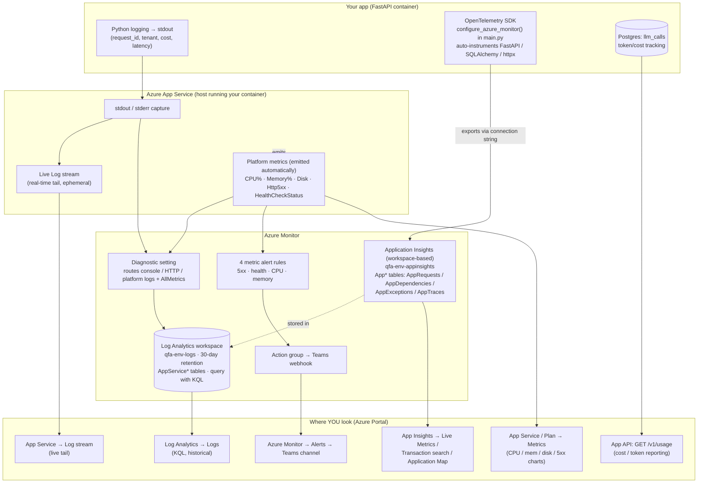

# Observability

Logging, request tracing, and usage reporting.

## Where logs go

The app writes structured logs to stdout. On Azure App Service these are picked up by the App Service log stream and any attached log sink. Locally, they show up in your terminal.

The log level is controlled by `LOG_LOGLEVEL` for application packages (default `DEBUG`) and `LOG_LOGLEVEL_3RDPARTY` for third-party libraries (default `WARNING`). Both accept either a numeric level or a string (`"debug"`, `"info"`, `"warning"`, `"error"`, `"critical"`).

## Hard prohibitions

Some things must **never** appear in logs at any level:

- Feedback record `text` / `content`
- User-supplied `prompt`
- The assembled system or user message sent to the LLM
- LLM response text
- API key values (protected by `SecretStr`)

The constants and helpers in `qfa.utils` make this easy to honour. When in doubt, log the character count or a hash, not the value.

## Safe to log

Everything that's not in the prohibition list above is fine, especially:

- `request_id` (every response carries `X-Request-ID`)
- `tenant_id` from the authenticated key
- `operation` (`analyze`, `summarize`, …)
- Record count, estimated tokens
- Attempt numbers and retry reasons
- Model name, latency, `prompt_tokens`, `completion_tokens`, `cost`
- HTTP status codes

## Pipeline timing

Hierarchical analysis (`mode=hierarchical`) logs where wall-clock time goes, so a
slow run can be diagnosed from logs alone — no profiler attach required.

- **Per phase, at INFO** — `Orchestrator.analyze_hierarchical` logs a `starting
  <phase>` line *before* each potentially slow step (embedding, clustering, map,
  reduce, then judge) and a `<phase> … in <seconds>s` line after it, plus a closing
  one-line breakdown: `analyze_hierarchical done in 87.7s (anonymise=… embed=…
  cluster=… map=… reduce=… judge=…)`. Reduce runs *before* the judges (the
  synthesis is the deliverable and gets slot priority; the judges only feed the
  confidence), so the two are timed separately. The map line reports the
  concurrency cap (`up to N concurrent LLM call(s)`). These lines carry only
  record/chunk counts and durations.
- **Per chunk and per LLM call, at DEBUG** — each map chunk logs a `starting map
  chunk i/N` line and a `done` line; each leaf judge logs a `starting`/`done` line
  with its score (or `excluded` when the chunk could not be judged). The reduce
  phase is a *recursive* tree-reduce rather than a flat fan-out; rather than log
  every call, it emits a single line each time it has to split (`N partial(s)
  exceed the token budget; tree-reducing in K group(s)`), so a multi-level
  synthesis is visible without one line per group. The per-chunk `done` lines
  split their duration into `queued=<s>` (time waiting for a
  concurrency slot) and `call=<s>` (the LLM round-trip after the slot was
  acquired), so a long chunk caused by queue backlog is distinguishable from a
  genuinely slow call. Each LLM round-trip also logs `model`, `latency`,
  `prompt_tokens`, `completion_tokens`, and `cost` from the `LiteLLMClient`
  adapter, and its per-attempt timeout plus the retry budget. DEBUG (not INFO)
  because hierarchical mode fans out one call per chunk plus judges and reduces —
  at INFO this would flood the log. Because map runs concurrently, these per-chunk
  lines interleave.

All of these are built from the safe-to-log list above; none interpolate
feedback text, prompts, or model output. The timing itself comes from
`qfa.utils.timed`, a context manager that measures a block and deliberately does
**not** log — the caller owns the message and keeps it content-free.

Raise the app log level to `INFO` (`LOG_LOGLEVEL=info`) to keep the phase
breakdown while dropping the per-call/per-chunk noise.

## Request tracing

Every response includes an `X-Request-ID` header generated by the request-id middleware. The header value is a canonical UUID string and is also the value persisted in `llm_calls.call_id` for every LLM call the request makes — so the same ID appears in the response header, every log line for that request, the error envelope's `request_id` field, and the database. A caller reporting a 502 can hand you that one UUID and you can grep the logs end-to-end and `SELECT … FROM llm_calls WHERE call_id = '<uuid>'` to recover the cost/duration history for the request.

## Usage queries

Two endpoints expose aggregates over the `llm_calls` table:

- `GET /v1/usage` — stats scoped to the caller's tenant. Accepts `from` and `to` query parameters (ISO 8601, timezone-aware).
- `GET /v1/usage/all` — stats across all tenants. Requires `is_superuser=true`.

Returned shape: counts and token totals per operation, plus simple latency distribution stats. The endpoints are reporting-only — no mutation.

If the database is down, both endpoints return 503 with `code=usage_backend_unavailable` — a transient condition, so retry with backoff.

## Azure Monitor

App Service logs are shipped to an Azure Log Analytics workspace (`qfa-<env>-logs`) and surfaced in Application Insights (`qfa-<env>-appinsights`). Both are created by Terraform in `infra/observability.tf`. The App Service passes the App Insights connection string to the container as `APPLICATIONINSIGHTS_CONNECTION_STRING` (wired in `infra/app_service.tf`), which Pydantic Settings loads into `AppSettings.telemetry.applicationinsights_connection_string`. The OpenTelemetry SDK is then initialised from that setting at startup — see below.

### Architecture at a glance

New to Azure? Start here. There are **two independent signal sources**, and they
answer different questions — confusing them is the single most common source of "the
deployment looks broken when it mostly isn't":

- **Application logs** — text the Python code emits (`logging.getLogger(...)`). Answers
  *"what did the code do / why did this request fail?"*
- **Platform metrics** — CPU / memory / disk / HTTP counters the Azure **host** emits
  automatically, with zero code. Answers *"is the box healthy / saturated?"*

Plus a third, app-specific channel that is neither of those: **cost/usage** tracked in
Postgres and exposed via `GET /v1/usage`.

The critical thing the diagram makes explicit is that **Log Analytics and Application
Insights are two separate sinks filled by two different pipes** — even though
workspace-based App Insights physically *stores* its data inside the same Log Analytics
workspace. The **diagnostic setting** pushes `AppService*` log tables into Log Analytics
with no app involvement; the **OpenTelemetry SDK inside the container** pushes the
`App*` telemetry tables (`AppRequests`, `AppDependencies`, `AppExceptions`, `AppTraces`)
into Application Insights over the connection string. They fail independently: logs can
arrive while App Insights stays empty, or vice-versa.



The one-line mental model: **host signals** (stdout logs, CPU%, memory%) do *not* need
the OTel SDK and already have homes — Log stream / Log Analytics for logs, the Metrics
blade for CPU/memory. **Application telemetry** (per-request traces in the App Insights
`App*` tables) is what the OTel SDK lights up. Wiring OTel is required for App Insights;
it is *not* required for logs or host metrics.

### Running these queries in the portal

1. Azure Portal → search for **`qfa-<env>-logs`** (or **Resource group → `qfa-<env>-logs`**) and open the Log Analytics workspace.
2. In the workspace's left-hand menu, open **Logs**. Dismiss the sample-queries dialog if it appears — you want the empty editor.
3. Paste a query into the editor and set the time range with the picker above it. If the query already contains a `TimeGenerated` filter, the picker shows *Set in query* and defers to it — don't set both.
4. Click **Run** (or press Shift+Enter). Click any result row to expand its full set of columns.

Two gotchas: **Run** executes the *whole* editor unless you first select a single query, and a *"failed to resolve table"* error means nothing has been ingested into that table yet — it is not a syntax error. Ingestion also lags the live log stream by a few minutes (see below), so re-run after a short wait if a fresh event is missing.

The Application Insights `App*` tables (populated by the OpenTelemetry SDK — delivery pending verification, see below):

```kql
// All requests in the last hour
AppRequests
| where TimeGenerated > ago(1h)
| project TimeGenerated, Name, ResultCode, DurationMs

// Exceptions
AppExceptions
| where TimeGenerated > ago(1h)
| project TimeGenerated, ProblemId, OuterMessage
```

### App Service log tables

The queries above target the Application Insights `App*` tables, which the
OpenTelemetry SDK populates (see the **OpenTelemetry SDK** section below —
delivery is currently pending verification). Independently of the SDK, the App
Service **diagnostic setting** in `infra/observability.tf` ships three log
categories straight to the same workspace, so these tables are populated as soon
as the container runs — they are the authoritative log source today:

- `AppServiceConsoleLogs` — the container's stdout/stderr: the application's
  `qfa.*` log lines plus gunicorn output. The message text is in the
  **`ResultDescription`** column.
- `AppServicePlatformLogs` — App Service platform lifecycle events: container
  start/stop, warm-up probe results, and startup failures such as
  `ContainerTimeout`. The message text is in the **`Message`** column — a
  *different* column name from the console table, which is easy to trip over in a
  joint query.
- `AppServiceHTTPLogs` — one row per HTTP request (method, path, status,
  latency), written by the front end regardless of whether the app logs.

**Container (console) logs** — the application's own output:

```kql
AppServiceConsoleLogs
| where TimeGenerated > ago(1h)
| project TimeGenerated, ResultDescription
| order by TimeGenerated desc
```

**Platform logs** — container lifecycle and startup failures (note `Message`, not
`ResultDescription`):

```kql
AppServicePlatformLogs
| where TimeGenerated > ago(1h)
| project TimeGenerated, Level, Message
| order by TimeGenerated desc
```

**Joint view** — console and platform logs merged into one time-ordered stream
(the Log Analytics equivalent of `az webapp log tail`). The two tables name their
message column differently, so `coalesce` picks whichever is populated per row,
and `Type` records which table each row came from:

```kql
union AppServiceConsoleLogs, AppServicePlatformLogs
| where TimeGenerated > ago(1h)
| extend Msg = coalesce(ResultDescription, Message)
| project TimeGenerated, Type, Msg
| order by TimeGenerated desc
```

Log Analytics ingestion lags the live **App Service → Log stream** (and
`az webapp log tail`) by roughly 2–5 minutes. Use the log stream for real-time
debugging and these queries for historical search, filtering, and alerting.

## Alerting

Four metric alert rules are provisioned in `infra/observability.tf`, all routed through the `qfa-<env>-alerts` action group, which POSTs to the Microsoft Teams incoming webhook configured via `var.teams_webhook_url` (see [Set up a new environment](setup-new-env.md)):

| Alert | Metric | Threshold | Severity |
|---|---|---|---|
| HTTP 5xx | `Http5xx` | >5 in 5 min | 2 |
| Health check | `HealthCheckStatus` | <1 (i.e. `/v1/health` failing) | 1 |
| High CPU | `CpuPercentage` | >80% for 5 min | 2 |
| High memory | `MemoryPercentage` | >80% for 5 min | 2 |

The health-check alert (severity 1) fires when the App Service platform's built-in health probe of `/v1/health` fails — this is the most direct signal that the container is down or crashed.

## OpenTelemetry SDK

`src/qfa/main.py` calls `configure_azure_monitor()` at startup, gated on
`TelemetrySettings.applicationinsights_connection_string` (so local dev, where the setting
is unset, is unaffected). The connection string is passed explicitly from settings rather than
re-read from the environment by the SDK. This auto-instruments FastAPI, SQLAlchemy, and
httpx and exports traces to Application Insights, populating the `AppRequests`,
`AppDependencies`, and `AppExceptions` tables queried above.

> **Verification pending.** The SDK call is in place but end-to-end delivery has not yet
> been confirmed against a deployed environment. Until it is, treat the App Service log
> stream as the authoritative trace source and verify the `App*` tables are populated after
> the next deploy.

**Validating that App Insights receives telemetry** (fastest → slowest):

1. **App Insights → Live Metrics** (`qfa-<env>-appinsights`). Near-real-time (~1 s) and
   it *bypasses* the 2–5 min ingestion lag that affects the KQL tables. Open it, then
   send a handful of requests (`curl https://<app>/v1/health`). If the server shows as
   **connected** and the request rate ticks up, OTel is exporting. If it stays "not
   connected", the SDK isn't emitting (check the connection string reached the container
   and the app is not crash-looping — a batched exporter loses telemetry if the container
   is `SIGKILL`ed before it flushes).
2. **Transaction search** — inspect a single request end-to-end (request + dependencies +
   exceptions), correlated by `OperationId`.
3. **Logs (KQL)**, after ingestion:
   `AppRequests | where TimeGenerated > ago(15m) | project TimeGenerated, Name, ResultCode, DurationMs`.
4. **Application Map** — appears once `AppDependencies` has rows; draws app → Postgres →
   OpenAI.

Because `configure_azure_monitor()` also exports Python `logging` records as `AppTraces`,
once OTel is confirmed working your application logs appear in **both**
`AppServiceConsoleLogs` (via the diagnostic setting) and `AppTraces` (via the SDK) — the
same lines, two tables, two independent delivery paths.
