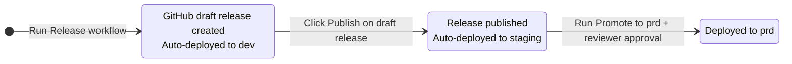
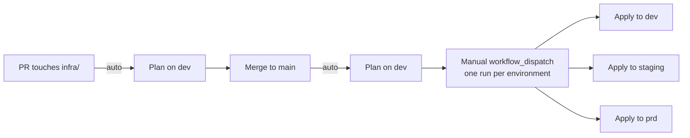

# Release flow

How application code and infrastructure changes reach `dev`, `staging`, and `prd`.

For the *runtime* picture (what runs once a release is live), see [Deployment: runtime overview](deployment.md). To find out what is *currently* live in each environment, see [Check deployed versions](check-deployed-versions.md). For first-time provisioning, see [Infrastructure bootstrap](bootstrap.md) and [Set up a new environment](setup-new-env.md).

## App releases — promotion at a glance

Three human actions drive the whole flow: run the Release workflow, click Publish on the draft release, and run Promote to prd (with reviewer approval). Publishing is the sign-off that dev validation passed *and* the trigger for two auto-deploys — the click fires `auto-staging-on-publish.yaml` (deploys the same digest to staging) and `docs.yaml` (publishes the Sphinx docs to GitHub Pages), both with no extra workflow run. The same image digest flows through all three app-runtime states — no rebuilds between environments.

### Normal release (e.g. v0.4.0)

1. Human runs **Release** from the Actions tab. CI runs, version bumps to v0.4.0, image builds, gets pushed to Azure Container Registry (ACR) as `qfa-backend:v0.4.0`, registry digest captured, draft release v0.4.0 created with the digest in its body, dev App Service updated to run that digest. Total: one click.
2. Human pokes around in dev. Finds nothing wrong.
3. Human goes to the Releases page and clicks **Publish** on the v0.4.0 draft. Publishing the release automatically fires `auto-staging-on-publish.yaml` (deploys the same digest to staging) and `docs.yaml` (publishes the Sphinx docs to GitHub Pages) — the click is both the sign-off that dev validation passed *and* the trigger for those two auto-deploys.
4. Final smoke testing in staging.
5. Human runs **Promote to prd** with input `v0.4.0`. The Verify job checks "published and not pre-release", then enters the prd environment, which triggers GitHub's required-reviewers prompt. Reviewer approves. Same digest deploys to prd.

> [!NOTE]
> The manual `Promote to dev` and `Promote to staging` workflows exist as **secondary** paths — used to restore an environment to a specific released tag outside the normal forward flow. Typical uses: re-point dev back to a release after an ephemeral feature-branch build (see below), roll staging back to a prior release, or re-stage an older release for re-validation. They are not part of the normal forward flow.

### Rollback (e.g. v0.4.0 → v0.3.7)

1. Human runs **Promote to prd** with input `v0.3.7`. Verify passes (v0.3.7 is published and final). Reviewer approves the prd environment prompt. App Service is repointed to v0.3.7's digest, which is still sitting in ACR. Done.

### Testing a feature branch in dev without cutting a release

1. Human runs **Build from commit** with `ref: feat/some-experiment` and `deploy_to_dev: true`. An ephemeral image gets built and pushed as `qfa-backend:ephemeral-feat-some-experiment-<sha>`, dev gets updated to that digest. No release is created — so the image cannot enter the promotion pipeline. To get back to a real release, run **Promote to dev** with the latest released tag.

## Documentation publishing

The Sphinx docs (built by `make docs`, sources under `docs/`) are published to GitHub Pages at <https://rodekruis.github.io/qualitative-feedback-analysis/>.

The `docs.yaml` workflow (`.github/workflows/docs.yaml`) builds the docs on every push as a CI gate so doc-rot is caught early, but only deploys to Pages in two cases:

- **Release published.** When a draft release is published (the same click that fires the staging deploy in the app flow above), the docs site is rebuilt from the published commit and pushed live. This keeps the public docs aligned with the latest released version.
- **Manual dispatch.** Run the `Docs` workflow from the Actions tab to push a one-off update — useful for doc-only fixes between releases.

The published site reflects releases, not `main`. A merge to `main` triggers a build (so a broken doc PR fails CI) but does not deploy — the published site only moves forward when a release is cut or a human dispatches the workflow.

> [!NOTE]
> First-time setup requires enabling Pages in repo Settings → Pages with **Source: GitHub Actions**. Without that, the first `deploy-pages` step fails with a 404. This is a one-time repo setting, not a per-deploy step.

## Infrastructure changes

Contrast with the release flow above: applies fan out from a single manual-dispatch hub to three independent environments — there is no promotion chain and no enforced ordering between them. `plan` runs automatically on PRs and on `main`, but `apply` is manual-only.

Infrastructure (Azure App Service, Key Vault, managed identities, etc.) is managed by Terraform and deployed **independently** of application code. For deployed environments, PostgreSQL application authentication is Entra-only via managed identity token flow (password auth is disabled on the server). Database migrations in production run via `python -m qfa.cli.migrate` (invoked by `entrypoint.sh`) so Alembic uses the lock-managed connection and Entra-capable auth path.

The `terraform.yaml` workflow (`.github/workflows/terraform.yaml`) runs `plan` automatically on PRs and pushes touching `infra/`, but **never runs `apply` automatically** — `apply` only executes when dispatched manually with `command: apply`.

### Applying an infra change

1. Open a PR touching `infra/`. CI runs `terraform plan` automatically so reviewers can see the proposed diff. Note that the automated plan runs against the `dev` workspace only — diffs against `staging` / `prd` require a manual `workflow_dispatch` run.
2. Merge the PR to `main`. Plan runs again on `main` as a sanity check. Nothing is applied.
3. Run the `Terraform` workflow from the Actions tab with `environment: dev`, `command: apply`. Verify dev.
4. Repeat step 3 for `staging`, then for `prd`.

> [!IMPORTANT]
> If an infrastructure change is a prerequisite for an app version (e.g. a new Key Vault reference, a new environment variable binding), apply the infra change to a given environment **before** promoting the app release that depends on it — otherwise the App Service will start but fail at runtime when the missing reference resolves.

## GitHub environments and variables

GitHub environments (`dev`, `prd`) and their required Actions variables are managed by Terraform — see [Infrastructure bootstrap](bootstrap.md).
