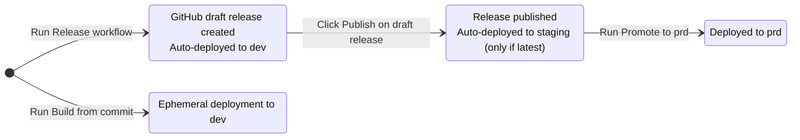

# Release flow

How application code and infrastructure changes reach `dev`, `staging`, and `prd`.

For the *runtime* picture (what runs once a release is live), see [Deployment: runtime overview](deployment.md). To find out what is *currently* live in each environment, see [Check deployed versions](check-deployed-versions.md). For first-time provisioning, see [Infrastructure bootstrap](bootstrap.md) and [Set up a new environment](setup-new-env.md).

## App releases — promotion at a glance

```mermaid
stateDiagram-v2
    direction LR
    state "GitHub draft release created<br/>Auto-deployed to dev" as Dev
    state "Release published<br/>Auto-deployed to staging (only if latest)" as Published
    state "Deployed to prd" as Prd
    state "Ephemeral deployment to dev" as Ephemeral

    [*] --> Dev: Run Release workflow
    Dev --> Published: Click Publish on draft release
    Published --> Prd: Run Promote to prd
    [*] --> Ephemeral: Run Build from commit
```

Three human actions drive the whole flow: run the Release workflow, click Publish on the draft release, and run Promote to prd. Publishing is the sign-off that dev validation passed *and* the trigger for two auto-deploys — the click fires `auto-staging-on-publish.yaml` (deploys the same digest to staging) and `docs.yaml` (publishes the Sphinx docs to GitHub Pages), both with no extra workflow run. **Both auto-deploys are guarded**: they only run when the published release is the *latest* version, so finalizing an older draft has no deploy side effects (see [Publishing an older draft](#publishing-an-older-draft-to-finalize-it) and [ADR-016](../adr/016-guard-auto-deploy-on-publish.md)). The same image digest flows through all three app-runtime states — no rebuilds between environments.

**Another way onto `dev`: Build from commit.** The forward flow above is not the only route into `dev`. **Build from commit** with `deploy_to_dev: true` builds an ephemeral image from any branch, tag, or SHA and deploys it straight to `dev` — no release cut, no promotion. Because it never writes a release body, that image is a dead end: it *cannot* flow onward to staging or prd. Use it to try an in-flight feature branch in `dev`; run **Promote to dev** with a released tag to return `dev` to the normal flow. See [Testing a feature branch in dev without cutting a release](#testing-a-feature-branch-in-dev-without-cutting-a-release).

> [!IMPORTANT]
> Infrastructure changes ride a separate track from application releases, and do not always arrive together. `prd` is protected, because Promote to prd applies Terraform before every deploy. `dev` and `staging` are not protected. Their automatic paths deploy code with no check that matching infrastructure is live. See [Infrastructure changes](#infrastructure-changes) below for what to do about it. Issue #224 tracks closing this gap.

### Normal release (e.g. v0.4.0)

1. Human runs **Release** from the Actions tab. CI runs, version bumps to v0.4.0, image builds, gets pushed to Azure Container Registry (ACR) as `qfa-backend:v0.4.0`, registry digest captured, draft release v0.4.0 created with the digest in its body, dev App Service updated to run that digest. Total: one click.
2. Human pokes around in dev. Finds nothing wrong.
3. Human goes to the Releases page and clicks **Publish** on the v0.4.0 draft. Publishing the release automatically fires `auto-staging-on-publish.yaml` (deploys the same digest to staging) and `docs.yaml` (publishes the Sphinx docs to GitHub Pages) — the click is both the sign-off that dev validation passed *and* the trigger for those two auto-deploys. Because v0.4.0 is the latest release, the latest-release guard lets both proceed.
4. Final smoke testing in staging.
5. Human runs **Promote to prd** with input `v0.4.0`. The Verify job checks "published and not pre-release", then deploys the same digest to prd. (There is no required-reviewer gate — see the note below.)

> [!NOTE]
> **Production has no required-reviewer gate.** `promote-to-prd.yaml` enforces only "published and not a pre-release"; deployment then proceeds. The `prd` GitHub environment is *not* configured with required reviewers (none is defined in Terraform). This is a deliberate choice for a small team — a reviewer gate that cannot be serviced quickly would block rollbacks during incidents. If the team grows, add required reviewers to the `prd` environment as an extra gate (see [ADR-016](../adr/016-guard-auto-deploy-on-publish.md)).

> [!NOTE]
> The manual `Promote to dev` and `Promote to staging` workflows exist as **secondary** paths — used to restore an environment to a specific released tag outside the normal forward flow. Typical uses: re-point dev back to a release after an ephemeral feature-branch build (see below), roll staging back to a prior release, or re-stage an older release for re-validation. They are not part of the normal forward flow.

### Rollback (e.g. v0.4.0 → v0.3.7)

1. Human runs **Promote to prd** with input `v0.3.7`. Verify passes (v0.3.7 is published and final). App Service is repointed to v0.3.7's digest, which is still sitting in ACR. Done. Manual promotion is deliberately **version-unguarded** — deploying an *older* version is the whole point of a rollback, so the latest-release guard (which only governs the automatic publish path) does not apply here.

### Publishing an older draft to finalize it

Sometimes you want to publish an old *draft* release purely to make it visible /
finalized in the release history — without deploying that old version anywhere.

1. Human clicks **Publish** on an old draft (e.g. `v0.3.0`) while a newer release
   (`v0.6.0`) already exists.
2. `auto-staging-on-publish.yaml` and `docs.yaml` each run their **latest-release
   guard** (`_is-latest-release.yaml`). The guard compares `v0.3.0` against all
   release tags (drafts included) using a semver-aware comparison and finds it is
   *not* the latest.
3. Both auto-deploys are **skipped** — staging and the docs site are untouched.
   Each workflow run stays green and posts a warning + job summary explaining that
   nothing deployed and how to deploy `v0.3.0` deliberately if that was actually
   intended (via **Promote to staging** / **Promote to prd** / a manual **Docs**
   dispatch).

If the guard cannot determine the latest release (e.g. an unparseable tag), it
**fails closed**: the run goes red and nothing deploys. See
[ADR-016](../adr/016-guard-auto-deploy-on-publish.md) for the rationale.

### Testing a feature branch in dev without cutting a release

1. Human runs **Build from commit** with `ref: feat/some-experiment` and `deploy_to_dev: true`. An ephemeral image gets built and pushed as `qfa-backend:ephemeral-feat-some-experiment-<sha>`, dev gets updated to that digest. No release is created — so the image cannot enter the promotion pipeline. To get back to a real release, run **Promote to dev** with the latest released tag.

## Documentation publishing

The Sphinx docs (built by `make docs`, sources under `docs/`) are published to GitHub Pages at <https://rodekruis.github.io/qualitative-feedback-analysis/>.

The `docs.yaml` workflow (`.github/workflows/docs.yaml`) builds the docs on every push as a CI gate so doc-rot is caught early, but only deploys to Pages in two cases:

- **Release published — and only if it is the latest release.** When a draft release is published (the same click that fires the staging deploy in the app flow above), the docs site is rebuilt from the published commit and pushed live — *provided* the latest-release guard confirms it is the newest version. Publishing an older draft to finalize it does **not** rebuild the site (it would regress the docs to an old commit); the deploy is skipped with a warning. This keeps the public docs aligned with the latest released version.
- **Manual dispatch.** Run the `Docs` workflow from the Actions tab to push a one-off update — useful for doc-only fixes between releases. Manual dispatch is **not** guarded (it is a trusted, deliberate action).

The published site reflects releases, not `main`. A merge to `main` triggers a build (so a broken doc PR fails CI) but does not deploy — the published site only moves forward when a release is cut or a human dispatches the workflow.

> [!NOTE]
> First-time setup requires enabling Pages in repo Settings → Pages with **Source: GitHub Actions**. Without that, the first `deploy-pages` step fails with a 404. This is a one-time repo setting, not a per-deploy step.

## Infrastructure changes

Terraform manages infrastructure such as Azure App Service, Key Vault, and managed identities. This infrastructure deploys independently of application code, so its Terraform apply does not always happen in step with an app release.

`plan` runs automatically on every PR and push that touches `infra/`. `apply` runs manually through the Actions tab, or automatically inside three specific promotion workflows. The table below shows, for each environment, whether the path that puts a release there also applies Terraform first.

| Environment | Path | Terraform apply gate |
|---|---|---|
| `dev` | `release.yaml` (automatic, on every release cut) | None |
| `dev` | Promote to dev (manual) | Automatic, before deploy |
| `staging` | `auto-staging-on-publish.yaml` (automatic, on publish) | None |
| `staging` | Promote to staging (manual) | Automatic, before deploy |
| `prd` | Promote to prd (the only path) | Automatic, before deploy |

`prd` is fully protected, because Promote to prd is its only door in. `dev` and `staging` are not protected. Their automatic, everyday paths deploy an app release with no check that the matching infrastructure is live. Issue #224 tracks closing this gap for `dev` and `staging`.

For deployed environments, PostgreSQL application authentication is Entra-only, through a managed identity token flow (password authentication is disabled on the server). Database migrations in production run through `python -m qfa.cli.migrate`, invoked by `entrypoint.sh`, so Alembic uses the lock-managed connection and the Entra-capable authentication path.

### Applying an infra change

1. Open a PR that touches `infra/`. CI runs `terraform plan` automatically, so reviewers can see the proposed diff. The automated plan runs against the `dev` workspace only. A diff against `staging` or `prd` needs a manual `workflow_dispatch` run.
2. Merge the PR to `main`. Plan runs again on `main` as a check. Nothing applies yet.
3. Run the `Terraform` workflow from the Actions tab with `environment: dev` and `command: apply`. Promote to dev also applies it for you automatically.
4. Repeat step 3 for `staging` and `prd`. Promote to staging and Promote to prd already do this automatically before they deploy.

> [!IMPORTANT]
> If a release depends on new infrastructure, apply it to `dev` and `staging` first. `release.yaml` and `auto-staging-on-publish.yaml` do not check this for you. A missing infra piece then surfaces only when the App Service fails at runtime. Only `prd` guards against this today, through Promote to prd. Issue #224 tracks closing this gap.

## GitHub environments and variables

GitHub environments (`dev`, `prd`) and their required Actions variables are managed by Terraform — see [Infrastructure bootstrap](bootstrap.md).
